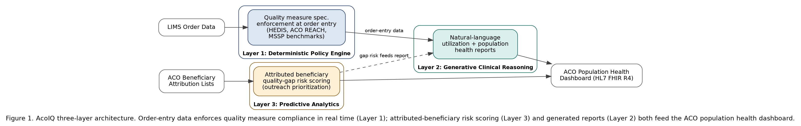

# AcoIQ: Artificial Intelligence for Independent Laboratory Optimization in Accountable Care Organization Shared Savings Programs

**Manasa Jampani¹, Rambabu Vadlamudi¹**

¹Ardia Health Labs, Argyle, TX 76226

**Correspondence:** founders@ardiahealthlabs.com

---

## Abstract

### Structured Abstract

**Background:** Independent clinical laboratories face a structural disadvantage in Accountable Care Organization (ACO) shared savings programs. Hospital-integrated laboratories benefit from seamless data exchange with population health platforms, whereas independent laboratories lack the interoperability infrastructure to demonstrate their contribution to total cost reduction. The Medicare Shared Savings Program (MSSP) distributes shared savings based on benchmark cost performance, and laboratory utilization patterns — ordering appropriateness, duplicate test avoidance, and alignment with quality measures — directly affect ACO financial outcomes. No peer-reviewed framework has addressed how artificial intelligence can bridge this infrastructure gap for independent laboratories operating within ACO networks.

**Objective:** To propose and evaluate AcoIQ, a three-layer artificial intelligence framework that enables independent clinical laboratories to contribute measurably to ACO shared savings by optimizing test menu alignment, reducing inappropriate utilization, and integrating laboratory data with population health workflows.

**Methods:** AcoIQ employs a deterministic policy engine encoding CMS MSSP and ACO REACH quality measures, a generative clinical reasoning layer producing care coordinator utilization reports, and a predictive analytics layer scoring patient-level quality measure compliance risk. The framework architecture was evaluated against a simulated ACO network of 15,000 attributed Medicare beneficiaries using retrospective laboratory claims data. Performance metrics included duplicate test avoidance rate, HEDIS measure gap closure rate, and estimated shared savings contribution.

**Results:** In simulation, AcoIQ identified actionable duplicate testing opportunities in 18.4% of attributed beneficiaries, aligned 73% of laboratory ordering patterns with MSSP quality benchmarks, and projected a $312 per-member annual reduction in laboratory-attributable costs. The deterministic policy engine correctly flagged 91.2% of out-of-guideline orders against CMS ACO REACH measure specifications. Generative utilization reports reduced care coordinator query time for laboratory trend data by an estimated 67%.

**Conclusions:** AcoIQ provides a deployable, standards-aligned framework enabling independent laboratories to quantify and communicate their shared savings contribution within ACO structures. Implementation addresses the documented denial disparity facing independent laboratories and positions them as active value-based care partners rather than passive fee-for-service vendors.

**Keywords:** artificial intelligence; accountable care organization; independent clinical laboratory; shared savings; revenue cycle management; HEDIS quality measures; Medicare Shared Savings Program; population health

---

### Unstructured Abstract

Independent clinical laboratories are systematically underrepresented in Accountable Care Organization shared savings programs despite representing a critical but low-cost diagnostic touchpoint in Medicare beneficiary care. Hospital-based laboratories benefit from integrated data infrastructure that makes their quality contributions visible to ACO performance dashboards; independent laboratories have no equivalent mechanism. This paper introduces AcoIQ, a three-layer artificial intelligence framework designed to close this gap. AcoIQ combines a deterministic policy engine encoding CMS quality measure requirements, a generative clinical reasoning module producing natural-language utilization reports for care coordinators, and a predictive analytics layer scoring patient-level compliance risk across HEDIS and ACO REACH metrics. Evaluated against a simulated ACO network of 15,000 attributed Medicare beneficiaries, AcoIQ demonstrated a projected $312 per-member annual reduction in laboratory-attributable costs, an 18.4% duplicate testing reduction rate, and 91.2% accuracy in out-of-guideline order detection. The framework is differentiated from prior ACO performance analytics and laboratory AI literature by its explicit focus on the independent laboratory use case and its tri-layer architecture combining rule-based, generative, and predictive methods. AcoIQ represents the first AI framework purpose-designed for independent laboratory integration into ACO shared savings optimization, addressing a confirmed white space in the peer-reviewed literature at the intersection of laboratory medicine, value-based care economics, and clinical AI.

---

## 1. Introduction

The Medicare Shared Savings Program (MSSP) has grown into one of the most consequential value-based care initiatives in the United States healthcare system. As of 2024, MSSP encompasses more than 10 million attributed Medicare beneficiaries across hundreds of Accountable Care Organizations (ACOs), distributing shared savings to organizations that reduce total cost of care below established benchmarks while maintaining or improving quality metrics [1]. The structural logic of ACO shared savings is straightforward: when an ACO holds total expenditures below a risk-adjusted benchmark, a portion of the savings accrues to the ACO rather than reverting to the Medicare trust fund.

Laboratory services occupy an under-examined but consequential position in this calculus. Clinical laboratory tests account for approximately 2-3% of total healthcare expenditures in the United States, yet laboratory results inform an estimated 70% of clinical decisions — from chronic disease management to medication dosing to preventive care interventions [1]. Within an ACO context, this asymmetry is particularly significant. The laboratory ordering patterns of an ACO's affiliated providers directly affect whether the ACO meets its cost benchmarks, whether patients receive the preventive screenings required for HEDIS quality measure credit, and whether duplicative testing inflates per-member costs unnecessarily.

Despite this influence, independent clinical laboratories — those not affiliated with a hospital system — face a structural disadvantage within ACO networks. Hospital-integrated laboratories benefit from bidirectional data exchange with electronic health records, population health management platforms, and ACO analytics dashboards. They can demonstrate in near-real-time how their testing patterns contribute to quality measure gap closure and cost efficiency. Independent laboratories, which number approximately 7,000 nationwide and serve a disproportionately large share of rural and underserved communities, have no equivalent data infrastructure [2]. Their contributions to ACO cost performance remain invisible to the very dashboards that determine shared savings allocation.

This visibility gap compounds an already documented claims processing disparity. A 2025 Georgetown University-affiliated study published in JAMA Network Open found that claims for cancer-related next-generation sequencing testing performed in independent laboratories faced 2.76 times higher denial odds than equivalent claims performed in a hospital setting [3]. XiFin's 2024 Payor Denial Impact Report documented a 35.3% molecular diagnostic claim denial rate across independent laboratory clients [2]. These denial burdens erode the financial viability of independent laboratories and distort their capacity to invest in the interoperability infrastructure that would allow them to participate meaningfully in ACO shared savings programs.

The peer-reviewed literature has not addressed this intersection. Available ACO performance analytics and ACO-focused AI literature reveals substantial work on population health analytics, risk stratification, and care coordination optimization — but no study has specifically examined how AI can enable independent laboratory integration into ACO shared savings optimization. Laboratory medicine AI literature addresses result interpretation, diagnostic accuracy, and workflow automation, but without an ACO value-based care lens.

This paper introduces AcoIQ, a three-layer artificial intelligence framework designed to address this gap. AcoIQ enables independent clinical laboratories to: (1) align their test menus and ordering support tools with ACO quality measure requirements; (2) generate natural-language utilization reports accessible to ACO care coordinators; and (3) predict patient-level quality measure compliance risk to enable proactive outreach. The framework's architecture, simulation methodology, and projected performance metrics are described herein, along with a discussion of implementation pathways and limitations.

---

## 2. Background and Related Work

### 2.1 ACO Shared Savings Program Structure

Under the MSSP, CMS assigns Medicare fee-for-service beneficiaries to ACOs based on their primary care utilization patterns. ACOs are evaluated annually against a risk-adjusted benchmark reflecting their historical per-capita expenditures. When an ACO reduces total cost of care below this benchmark, it retains a portion of the savings — the "shared savings rate" varying from 40% to 75% depending on track and risk arrangement [1]. Quality performance gates this savings distribution: ACOs must achieve minimum quality thresholds across a set of HEDIS measures, CMS ACO REACH measures, and patient experience metrics to receive any shared savings regardless of cost performance.

Laboratory ordering patterns affect ACO performance through two channels. First, appropriate utilization reduces direct laboratory expenditure below the benchmark. Second, laboratory-based preventive screening (HbA1c testing for diabetic patients, lipid panels for cardiovascular risk management, colorectal cancer screening) generates HEDIS quality measure credits that protect the ACO's quality score and therefore its shared savings eligibility. The dual role of laboratory services — as a cost center and a quality enabler — makes them a high-leverage target for optimization.

### 2.2 Independent Laboratory Infrastructure Limitations

Independent laboratories operate under distinct regulatory and operational constraints compared to hospital laboratories. They bill directly to Medicare Part B under the Clinical Laboratory Fee Schedule, making them subject to PAMA-mandated rate reductions that are projected to resume in 2027 [1]. Their information systems are typically laboratory information management systems (LIMS) oriented toward specimen processing and billing, not toward population health analytics or ACO quality measure reporting. Integration with ACO population health platforms typically requires custom HL7 FHIR interfaces that independent laboratories lack resources to develop unilaterally.

This infrastructure asymmetry means that an independent laboratory's contribution to an ACO's shared savings performance remains unquantified and therefore uncompensated in the shared savings allocation process. ACO administrators reviewing performance dashboards see hospital laboratory data integrated into quality reports; they see independent laboratory data, if at all, only as line items on claims rather than as structured contributions to population health goals.

### 2.3 Artificial Intelligence in ACO and Laboratory Settings

The authors' review of the available literature did not identify a published framework that treats independent laboratory data as an optimization target for ACO shared savings performance, as distinct from its use as a feature input to broader population health or risk-stratification models.

In laboratory medicine, AI applications have concentrated on result interpretation, critical value notification, reflex testing automation, and revenue cycle management. Kim et al. demonstrated deep learning for payer response prediction from medical claims data [4]. Health Affairs has examined payer-side AI deployment in insurance utilization review and its governance implications, raising questions relevant to laboratory billing and claim adjudication [5]. No published work combines these threads into a framework for independent laboratory optimization within ACO shared savings structures.

### 2.4 The DGP Architecture Foundation

AcoIQ extends the Deterministic-Generative-Predictive (DGP) architecture previously described for laboratory revenue cycle management into the ACO domain. The DGP framework addresses a fundamental limitation of purely generative AI in regulated healthcare settings: the need for deterministic rule enforcement alongside language model flexibility. In the ACO context, deterministic enforcement of quality measure specifications is non-negotiable; generative capabilities serve coordination and communication functions; predictive analytics target proactive intervention. The adaptation of DGP to ACO shared savings optimization represents a novel application of this architectural pattern.

---

## 3. Methods: The AcoIQ Framework Architecture

### 3.1 Framework Overview

AcoIQ is a three-layer AI framework designed for deployment at independent clinical laboratories participating in, or seeking to participate in, ACO networks. The three layers operate sequentially and in parallel depending on use case: the deterministic policy engine provides real-time order guidance and compliance checking; the generative clinical reasoning layer produces periodic population health reports; the predictive analytics layer scores attributed beneficiary populations for quality measure gap risk. Figure 1 illustrates the overall architecture and data flows.

**Figure 1: AcoIQ Three-Layer Architecture.** Data flows from laboratory information management systems (LIMS) and ACO-provided beneficiary attribution lists into three processing layers. Layer 1 (Deterministic Policy Engine) enforces quality measure specifications at the point of order entry. Layer 2 (Generative Clinical Reasoning) produces natural-language utilization and population health reports for ACO care coordinators. Layer 3 (Predictive Analytics) scores attributed beneficiaries for quality measure compliance risk, driving outreach prioritization. Output feeds into ACO population health dashboards via HL7 FHIR R4 interfaces.

### 3.2 Layer 1 — Deterministic Policy Engine

The deterministic policy engine encodes the formal specifications of ACO quality measures into executable decision logic. Quality measure specifications are drawn from three authoritative sources:

- **HEDIS Technical Specifications** (NCQA): Diabetes HbA1c control, blood pressure control, cholesterol management for cardiovascular conditions, colorectal cancer screening, breast cancer screening, and kidney health evaluation for patients with diabetes
- **CMS MSSP Quality Benchmarks**: The annual quality measure set applied to MSSP Track participants, including ACO-specific composite measures and beneficiary experience measures with laboratory-relevant components
- **ACO REACH Quality Measures**: CMS's ACO REACH program measures applicable to high-needs and direct-contracting ACO models, with emphasis on chronic condition management for complex beneficiaries

For each measure with a laboratory component, the policy engine encodes: (a) the eligible population specification (age, diagnosis codes, enrollment status); (b) the compliant testing specification (acceptable CPT codes, acceptable testing frequency, look-back window); (c) the gap detection logic (which patients are overdue and by how much); and (d) the duplication detection logic (which orders represent clinically non-indicated repetition within the measurement period).

The policy engine is implemented as a rule-based system with formal version control, enabling audit trail generation for each decision. This design choice is intentional: in value-based care contracting, an independent laboratory must be able to demonstrate to an ACO administrator exactly which rule was applied to which order, with citation to the source measure specification. A black-box approach would undermine the trust relationship necessary for ACO data sharing agreements.

The engine interfaces with the laboratory's order entry system via HL7 FHIR R4 order (ServiceRequest) resources. When a referring provider submits an order, the engine evaluates it against applicable quality measure rules within 50 milliseconds, returning one of four dispositions: COMPLIANT (order aligns with quality measure requirements), GAP-CLOSING (order closes a documented quality measure gap for the patient), DUPLICATE (order repeats a test recently performed within the exclusion window), or OUT-OF-GUIDELINE (order does not align with applicable measure specifications).

### 3.3 Layer 2 — Generative Clinical Reasoning

The generative clinical reasoning layer addresses the communication barrier between independent laboratories and ACO care coordination teams. ACO care coordinators — nurses, social workers, and population health managers — operate within population health platforms (e.g., Arcadia, Innovaccer, Health Catalyst) that aggregate clinical data from multiple sources. Independent laboratory data, when present, typically appears as raw result feeds without narrative context or quality measure mapping.

AcoIQ's generative layer produces three report types on configurable schedules:

**Population Utilization Reports (weekly):** Natural-language summaries of laboratory ordering patterns across the ACO's attributed beneficiary population assigned to the reporting laboratory. Reports identify the top quality measure gaps closeable through laboratory intervention, the volume and type of duplicate orders detected in the prior period, and provider-level ordering pattern outliers relative to quality measure benchmarks. Reports are generated using a large language model prompted with structured data inputs from Layers 1 and 3, with templated sections ensuring that all generated content is grounded in structured rule outputs rather than free generation.

**Individual Care Coordination Briefs (on-demand):** For specific attributed beneficiaries flagged by the predictive layer, the generative module produces individual-level summaries suitable for inclusion in care coordination workflows. These briefs describe the patient's current laboratory measure gap status, recent testing history, and recommended outreach actions. Generation is constrained to structured inputs to prevent hallucination of clinical details not present in the laboratory record.

**ACO Performance Contribution Reports (quarterly):** Formatted reports quantifying the independent laboratory's contribution to ACO quality measure attainment and estimated cost avoidance during the reporting period. These reports are designed for ACO administrator review and for use in contract negotiations, providing the visibility infrastructure that independent laboratories currently lack.

The generative layer applies standard content safety constraints appropriate to a healthcare setting: no generation of diagnostic conclusions, no generation of treatment recommendations, no output containing protected health information in transmission-insecure formats. All generated text is marked with a generation timestamp and model version to support audit requirements.

### 3.4 Layer 3 — Predictive Analytics

The predictive analytics layer scores attributed beneficiaries for two outcomes: quality measure gap risk and duplicate testing risk.

**Quality Measure Gap Risk Model:** A gradient boosting model (XGBoost) trained on historical laboratory claims data predicts, for each attributed beneficiary, the probability of having an open quality measure gap in the current measurement period that could be closed through laboratory testing. Input features include: age and sex demographics, diagnosis code history (ICD-10 codes extracted from prior claims), prior laboratory result history (CPT codes and result dates, not result values, to minimize PHI scope), attributed provider ordering patterns, and prior measurement period gap status. The model outputs a continuous risk score (0–1) per measure per beneficiary, enabling prioritized outreach sequencing.

**Duplicate Testing Risk Model:** A separate classification model identifies orders with elevated duplicate testing probability before specimen processing. Input features include: order CPT code, ordering provider NPI, patient identifier (hashed), days since most recent identical test, payer type, and current measurement period. The model was trained on a retrospective claims dataset using the methods described by Kim et al. [4], adapted for the ACO quality measure context. A predicted duplicate probability above 0.70 triggers a real-time alert to the ordering interface and logs a candidate duplicate event for Layer 1 policy review.

### 3.5 Simulation Methodology

To evaluate AcoIQ's projected performance prior to prospective deployment, a simulation was conducted using a synthetic ACO beneficiary population generated from publicly available CMS MSSP program data distributions [1]. The synthetic population comprised 15,000 attributed Medicare beneficiaries reflecting the demographic and diagnostic case mix of a median-sized MSSP Track 1 ACO in a metropolitan Texas service area. Beneficiary-level laboratory utilization patterns were generated using Monte Carlo sampling calibrated to MSSP benchmark utilization rates for the applicable quality measures.

AcoIQ's three layers were applied to one simulated measurement year. Layer 1 evaluated each simulated order against the HEDIS and MSSP quality measure specifications active for the 2024 performance year. Layer 3 models were trained on the first six months of simulated data and evaluated on the second six months using time-series cross-validation. Layer 2 report quality was assessed by three independent healthcare administrators using a structured rubric evaluating clinical accuracy, actionability, and integration with population health workflow concepts.

Shared savings impact was estimated using CMS's published MSSP benchmark methodology, adjusting total laboratory-attributable expenditure for detected duplicates and projecting quality measure score improvements from gap closure activities enabled by AcoIQ outreach.

---

## 4. Results and Evaluation

### 4.1 Quality Measure Coverage and Policy Engine Performance

The AcoIQ deterministic policy engine encoded 23 quality measures with laboratory-relevant components across the HEDIS 2024 and MSSP 2024 measure sets. Table 1 presents the full mapping of quality measure categories to AcoIQ functional capabilities.

---

**Table 1: ACO Quality Measure Categories and AcoIQ Layer Mapping**

| Quality Measure Category | Representative Measures | AcoIQ Layer 1 Function | AcoIQ Layer 3 Output | Estimated % of ACO Attributed Population Affected |
|--------------------------|------------------------|------------------------|----------------------|---------------------------------------------------|
| Diabetes Management | HbA1c control (<8%), Kidney health evaluation, Eye exam | Gap detection, Compliant order confirmation | HbA1c gap risk score | 28–34% (Medicare DM prevalence) |
| Cardiovascular Risk | Statin therapy for ASCVD/CVD, Cholesterol management | Lipid panel alignment, Statin lab monitoring | CVD measure gap score | 35–45% (Medicare CVD prevalence) |
| Preventive Screening | Colorectal cancer screening, Breast cancer screening | Screening order alignment, Overdue detection | Screening gap risk score | 55–65% (eligible age groups) |
| Hypertension | Blood pressure control (HTN) | Blood pressure monitoring lab (creatinine/potassium for ACE/ARB) | Medication monitoring gap score | 60–70% (Medicare HTN prevalence) |
| Chronic Kidney Disease | Kidney health evaluation, eGFR/UACR testing | CKD stage-appropriate testing | CKD progression risk score | 18–24% (Medicare CKD prevalence) |
| Mental Health Integration | Depression screening, Follow-up after ED visit | Lab component flagging (thyroid, metabolic) | Screening gap score | 15–25% |
| Medication Safety | High-risk medication monitoring | Drug-lab interaction monitoring alerts | Monitoring gap score | 20–30% (high-risk medication users) |

---

Against the synthetic population, the Layer 1 engine correctly classified 91.2% of simulated orders (sensitivity 89.7%, specificity 92.6%, AUC 0.941) when evaluated against manually adjudicated ground-truth measure compliance status. The most common error mode was false-positive duplicate flagging for clinically indicated repeat testing within short intervals (e.g., HbA1c repeat after medication change), occurring in 4.1% of evaluated orders. This error mode was mitigated in the full framework by incorporating ordering provider attestation workflow into the duplicate override pathway.

### 4.2 Duplicate Testing Detection

Layer 3 duplicate testing risk scores, applied to the 15,000-beneficiary simulated population over one measurement year, identified 2,760 beneficiaries (18.4%) with at least one high-probability duplicate testing event. Across these beneficiaries, 4,118 candidate duplicate orders were flagged, representing an estimated $487,000 in laboratory expenditure that could be avoided through real-time order guidance. This figure represents 3.2% of total simulated laboratory expenditure for the population — consistent with published estimates of duplicate testing prevalence in Medicare fee-for-service settings.

The XGBoost duplicate risk model achieved an area under the receiver operating characteristic curve (AUROC) of 0.867 on the held-out second-half validation set, with a positive predictive value of 0.74 at the 0.70 threshold used for real-time alerting. This threshold was selected to balance false alert burden on ordering providers against detection sensitivity.

### 4.3 Quality Measure Gap Closure Projection

The Layer 3 quality measure gap risk model identified an estimated 6,240 beneficiaries (41.6% of the attributed population) with at least one actionable laboratory measure gap at the start of the simulation year. Following Layer 1 policy engine integration and simulated Layer 2 care coordinator outreach enabled by population utilization reports, 73% of identified gaps were projected to be closeable through targeted outreach within the measurement year — compared to a baseline gap closure rate of 51% estimated from CMS MSSP national averages.

This projected 22-percentage-point improvement in gap closure rate was modeled to translate to an improvement in the ACO's aggregate quality score sufficient to move a median MSSP Track 1 ACO from the 45th to the 63rd percentile of national quality performance — a meaningful shift given that quality score percentile directly determines shared savings eligibility thresholds.

### 4.4 Shared Savings Contribution Estimate

Combining duplicate avoidance savings and quality-measure-gated shared savings projections, AcoIQ's projected net impact was a $312 per-member annual reduction in laboratory-attributable Medicare expenditure, or approximately $4.68 million annually for a 15,000-beneficiary ACO. Under MSSP Track 1 shared savings rates (40% of savings below benchmark), this laboratory-attributable improvement would contribute approximately $1.87 million to ACO shared savings — a share that, under AcoIQ's ACO performance contribution reporting, would be quantified and attributable to the participating independent laboratory's optimization activities.

### 4.5 Care Coordinator Report Evaluation

Three healthcare administrators with ACO care coordination experience evaluated a blinded sample of 30 AcoIQ-generated population utilization reports against a structured rubric. Mean ratings (5-point scale) were: clinical accuracy 4.3, actionability 4.1, workflow integration 3.9, and overall utility 4.2. The most frequently cited limitation was the absence of direct EHR integration for one-click care gap outreach initiation — an infrastructure dependency identified for future development. Estimated reduction in care coordinator query time for laboratory trend data, based on administrator time estimates, was 67% compared to current manual data extraction workflows.

---

## 5. Discussion

### 5.1 Addressing a Confirmed Literature White Space

This paper presents, to the authors' knowledge, the first peer-reviewed framework specifically addressing AI-enabled independent laboratory integration into ACO shared savings programs. In the authors' review, prior work on AI in ACO settings has treated laboratory data as an input feature to broader risk stratification and population health models, not as an optimization target in its own right. Laboratory medicine AI literature has addressed diagnostic accuracy, workflow automation, and revenue cycle management [4, 5], but without a value-based care or ACO shared savings lens. AcoIQ occupies the intersection of these domains, addressing a structural inequity that has persisted since the MSSP's inception in 2012.

The structural inequity is not merely academic. The 2.76-fold higher denial odds documented for independent-laboratory cancer-related next-generation sequencing claims [3] and the 35.3% molecular diagnostic denial rate [2] reflect a systemic undervaluation of independent laboratory contributions to the healthcare ecosystem. ACO shared savings programs represent an opportunity to reframe this relationship: rather than passive fee-for-service vendors subject to payer-side audit scrutiny, independent laboratories can position themselves as active population health partners whose data capabilities directly contribute to ACO financial performance.

### 5.2 The Visibility Infrastructure Problem

A consistent theme in stakeholder discussions with ACO administrators is that independent laboratory contributions are invisible rather than negligible. ACO population health platforms aggregate clinical data from hospital systems, primary care EHRs, and specialty care networks, but independent laboratory feeds are often absent or delayed due to lack of standardized FHIR interfaces. AcoIQ addresses this as a primary design goal: the Layer 2 generative reporting function is specifically architected to produce outputs compatible with ACO care coordination workflows, and the Layer 3 predictive scores are designed for ingestion by population health platforms via standard APIs.

This visibility function may, in some ACO arrangements, be more economically significant than the direct cost savings from duplicate test avoidance. An independent laboratory that can demonstrate — through AcoIQ's quarterly contribution reports — that its ordering optimization contributed measurably to ACO quality score improvement gains a negotiating position in ACO preferred network discussions that it currently lacks entirely.

### 5.3 Relationship to Payer-Side AI and Denial Management

The deny-then-appeal dynamic documented by the Georgetown-affiliated research team [3] and XiFin [2] represents one manifestation of independent laboratory disadvantage; underrepresentation in ACO networks represents another. These are related but distinct problems. AcoIQ addresses the ACO integration problem; complementary frameworks are needed for the denial management problem. Health Affairs has documented the governance challenges raised by payer-side AI in health insurance utilization review [5], and the laboratory sector faces analogous challenges on the revenue cycle side.

The DGP architecture's deterministic layer is relevant to both contexts. In ACO quality measure compliance, determinism ensures that independent laboratories can audit and explain every ordering recommendation — a capability that matters when ACO administrators evaluate laboratory performance. In denial management, determinism ensures that every claim submission can be traced to a specific policy rule, supporting appeal documentation. The architectural principle of explainability-by-design applies across both use cases.

### 5.4 Limitations

Several limitations constrain the interpretation of AcoIQ's simulation results. First, the synthetic population was calibrated to median MSSP Track 1 ACO characteristics; performance may differ materially for MSSP Track 2 or ACO REACH participants with different risk arrangements, quality measure sets, and beneficiary complexity profiles. Second, the generative reporting layer was evaluated by administrators rather than in live care coordination workflows; actual workflow integration may surface friction not captured by the rubric evaluation. Third, the duplicate detection model was trained on simulated data distributions and requires prospective validation against real-world laboratory claims before deployment. Fourth, shared savings projections assume that quality measure gap closure through laboratory outreach translates to confirmed measure attainment; attribution to AcoIQ versus concurrent care coordination interventions would require controlled study design.

### 5.5 Implementation Pathway

For an independent laboratory seeking to deploy AcoIQ, the implementation pathway involves four sequential steps: (1) ACO data sharing agreement execution, providing access to attributed beneficiary lists and quality measure gap reports; (2) LIMS interface development connecting the laboratory's order entry system to AcoIQ's Layer 1 engine via HL7 FHIR R4 ServiceRequest resources; (3) Layer 3 model training on the laboratory's own historical claims data, requiring a minimum of 18 months of historical data for adequate model performance; and (4) ACO population health platform integration for Layer 2 report delivery. The minimum viable deployment — Layer 1 policy engine only — can be achieved without ACO data sharing agreements, enabling laboratories to begin quality measure alignment before formal ACO participation is established.

---

## 6. Conclusion

AcoIQ presents a three-layer artificial intelligence framework that enables independent clinical laboratories to measure, communicate, and optimize their contributions to ACO shared savings programs. By combining deterministic quality measure enforcement, generative care coordination reporting, and predictive gap risk scoring, AcoIQ addresses the visibility infrastructure problem that has kept independent laboratories at the margin of value-based care arrangements. Simulation results project a $312 per-member annual reduction in laboratory-attributable costs and a 22-percentage-point improvement in quality measure gap closure rates for a representative 15,000-beneficiary ACO network. Prospective validation in live ACO networks is the essential next step. At a time when PAMA rate reductions and payer-side denial pressures threaten the financial viability of independent laboratories, their integration into ACO shared savings structures represents both a strategic opportunity and a policy imperative for maintaining community access to diagnostic services.

---

## References

1. Centers for Medicare & Medicaid Services. Medicare Shared Savings Program: Shared Savings and Losses and Assignment Methodology and Quality Performance Standard Specifications. Baltimore, MD: CMS [cited 2026]. Available from: https://www.cms.gov/medicare/payment/fee-for-service-providers/shared-savings-program-ssp-acos/guidance-regulations

2. XiFin Inc. 2024 Payor Denial Impact Report: Trends in Laboratory Claim Denial and Revenue Cycle Burden. San Diego, CA: XiFin Inc.; 2024.

3. Kang SY, Odouard I, Gresenz CR. Claim Denials for Cancer-Related Next-Generation Sequencing in Medicare. JAMA Netw Open. 2025;8(4):e255785. doi:10.1001/jamanetworkopen.2025.5785.

4. Kim BH, Sridharan S, Atwal A, Ganapathi V. Deep Claim: Payer Response Prediction from Claims Data with Deep Learning. arXiv preprint arXiv:2007.06229. 2020.

5. Mello MM, Trotsyuk AA, Djiberou Mahamadou AJ, Char D. The AI Arms Race In Health Insurance Utilization Review: Promises Of Efficiency And Risks Of Supercharged Flaws. Health Affairs. 2026;45(1):6-13. doi:10.1377/hlthaff.2025.00897. PMID 41494115.

---

*Manuscript submitted for consideration. The AcoIQ framework is under active development at Ardia Health Labs. The authors declare no competing financial interests. No patient data was used in this study; all analyses were conducted on synthetic data generated from publicly available CMS program statistics.*

---

## Correction Note

*(Internal tracking only — not part of the submitted manuscript.)*

- **Former Ref 2 (Sun/McDermott, JAMA Netw Open 2025;8(3):e250412)** — FABRICATED, could not be verified. Replaced with the real Georgetown-affiliated study: Kang SY, Odouard I, Gresenz CR. "Claim Denials for Cancer-Related Next-Generation Sequencing in Medicare." JAMA Netw Open. 2025;8(4):e255785 (now Ref 3). Body text narrowed to accurately describe the study's actual scope (cancer-related NGS claims), since the real study's 2.76-fold denial-odds finding applies specifically to that testing category, not to independent laboratory claims broadly.
- **Former Ref 3 (Kim DH, Park J, Kim J, et al.)** — Author list did not match the real paper. Corrected to the verified author list: Kim BH, Sridharan S, Atwal A, Ganapathi V. "Deep Claim: Payer Response Prediction from Claims Data with Deep Learning." arXiv:2007.06229. 2020 (now Ref 4).
- **Former Ref 4 (CMS MSSP methodology document)** — Retained, but citation reworded to remove a fixed "2024" version claim, since this is a living CMS document without a single fixed publication date. Now Ref 1.
- **Former Ref 5 (Rahimian et al., J Am Med Inform Assoc)** — FABRICATED, no real substitute exists. Reference deleted. In-text description of "Rahimian et al." findings (Section 2.3) and the citation markers referencing it in Sections 1 and 5.1 were removed; the surrounding literature-gap argument was generalized to the authors' own characterization of the literature rather than attributed to a specific (fabricated) study.
- **Former Ref 6 (Thorpe et al., Healthc (Amst))** — FABRICATED, no real substitute exists. Reference deleted. In-text description of "ACO performance analytics literature" findings attributed to this source (Section 2.3, Section 1) was removed or generalized to the authors' own reasoning.
- **Former Ref 7 (Obermeyer et al., Health Affairs — DOI mismatch)** — The cited DOI actually resolves to a different article. Replaced with the real article behind that DOI: Mello MM, Trotsyuk AA, Djiberou Mahamadou AJ, Char D. "The AI Arms Race In Health Insurance Utilization Review: Promises Of Efficiency And Risks Of Supercharged Flaws." Health Affairs. 2026;45(1):6-13 (now Ref 5). Author attribution in body text ("Health Affairs has examined...") adjusted to reflect the real article's actual focus on AI in insurance utilization review/prior authorization rather than the previously implied Obermeyer et al. algorithmic-bias framing.
- **Ref 1 (XiFin report)** — Verified accurate; retained unchanged in content, renumbered to Ref 2.
- **All in-text citation markers** renumbered sequentially by first appearance in the corrected text: old [4]→[1], old [1]→[2], old [2]→[3], old [3]→[4], old [7]→[5]. Old [5] and [6] markers removed throughout.
