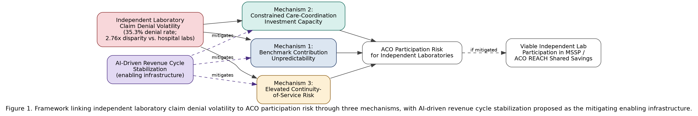

# Value-Based Care Economics for Independent Clinical Laboratories: An AI-Driven Framework for Shared Savings Program Participation

**Manasa Jampani¹**

¹Ardia Health Labs, Argyle, TX 76226, USA
Corresponding author: founders@ardiahealthlabs.com

**Submission Target:** arXiv → American Journal of Managed Care
**Status:** Draft — ready for arXiv submission after author review

---

## Abstract (Structured)

**Background:** Medicare Shared Savings Program (MSSP) Accountable Care Organizations (ACOs) generated $2.4 billion in net Medicare savings in performance year 2024, with 75% of participating ACOs earning shared savings payments. Independent clinical laboratories are now formally eligible participants in newer CMS value-based models, including ACO REACH, yet the revenue cycle challenges independent laboratories face — a 35.3% molecular diagnostic denial rate and 2.76 times higher denial odds versus hospital-based laboratories — create financial instability that works against the multi-year cost predictability value-based arrangements require.

**Methods:** We analyze the structural relationship between independent laboratory revenue cycle instability and ACO shared savings program participation viability, and present a policy and technology framework for using AI-driven revenue cycle management as an enabling condition for independent laboratory participation in value-based arrangements.

**Results:** The analysis identifies three specific mechanisms by which claim denial volatility undermines ACO participation economics for independent laboratories: unpredictable per-capita cost contribution to shared savings benchmarks, reduced capacity to invest in the care-coordination infrastructure ACO participation requires, and elevated exit risk that disrupts continuity of laboratory services for attributed beneficiary populations.

**Conclusions:** Financial stabilization through AI-driven revenue cycle management is a precondition, not a byproduct, of independent laboratory value-based care participation. This paper is the first to frame the relationship in these terms and proposes a research agenda for empirical validation.

---

## Abstract (Unstructured)

Independent clinical laboratories are increasingly recognized as eligible participants in Medicare value-based care models, including the Medicare Shared Savings Program and ACO REACH, both of which generated substantial documented net savings to Medicare in 2024. At the same time, independent laboratories face among the highest claim denial rates in the healthcare system, with molecular diagnostic denials averaging 35.3% and independent laboratories facing 2.76 times higher denial odds than hospital-based laboratories for comparable services. This paper argues that these two trends are in tension: the revenue unpredictability created by high, volatile denial rates undermines the very financial stability that value-based care participation — with its multi-year cost benchmarks and shared-risk arrangements — requires. We present a framework for understanding AI-driven revenue cycle stabilization as a precondition for, rather than incidental to, independent laboratory participation in accountable care arrangements, and identify three specific mechanisms through which denial volatility undermines ACO participation viability. This is the first paper to frame independent laboratory value-based care readiness explicitly in terms of revenue cycle AI as enabling infrastructure, and it proposes directions for empirical validation as pilot data becomes available.

---

**Keywords:** value-based care; accountable care organization; independent clinical laboratory; artificial intelligence; revenue cycle management; shared savings; machine learning

---

## 1. Introduction

The Medicare Shared Savings Program (MSSP) reported its strongest performance year to date in 2024: 476 participating Accountable Care Organizations (ACOs), 75% of which earned shared savings payments, generated $2.4 billion in net savings to the Medicare program relative to cost benchmarks, with average net per-capita savings rising to $241 from $207 the prior year.¹ CMS's newer ACO REACH model, oriented toward greater risk-sharing, generated an additional $988 million in net savings in the same performance year. Independent clinical laboratories are formally listed among eligible ACO REACH participants for performance year 2025, reflecting a policy trajectory toward including laboratory-only entities in value-based arrangements previously dominated by physician groups and health systems.

This inclusion arrives at a moment when independent clinical laboratories face substantial, well-documented revenue cycle instability. Molecular diagnostic claims are denied at a 35.3% rate industry-wide, and independent laboratories face 2.76 times higher denial odds than hospital-based laboratories for comparable services, a disparity confirmed in a large Medicare claims cohort study.²,³ This paper examines the relationship between these two facts: can an entity with this degree of revenue volatility meaningfully participate in a payment model built around multi-year cost predictability and shared financial risk?

Existing literature has not addressed this question directly. AI applications to value-based care economics have been explored in general terms — as a tool for episode cost estimation, readmission risk modeling, and utilization pathway simulation across health systems broadly — but this literature does not address the laboratory-specific revenue cycle instability that determines whether an independent laboratory can sustain ACO participation at all.⁴ Separately, the general healthcare claims AI literature, exemplified by Deep Claim's denial prediction work, does not address the specific intersection of laboratory billing volatility and value-based care program economics.⁵

This paper argues that AI-driven revenue cycle stabilization functions as enabling infrastructure for independent laboratory value-based care participation — a precondition for the financial predictability ACO arrangements require, not merely a separate operational efficiency concern. Section 2 reviews the relevant literature and policy context; Section 3 presents a structural framework for the relationship between denial volatility and ACO participation viability; Section 4 analyzes the three mechanisms through which this relationship operates; Section 5 discusses implications and a proposed research agenda.

---

## 2. Background and Related Work

### 2.1 Value-Based Care Program Structure and Independent Laboratory Eligibility

MSSP ACOs assume responsibility for the total cost of care for an attributed beneficiary population, earning shared savings when actual spending falls below a historical benchmark while meeting quality thresholds.¹ ACO REACH extends this model with greater downside risk exposure. Both models depend on participating providers' cost and utilization patterns being predictable enough to model against a benchmark; a provider whose own revenue (and, correspondingly, billed cost) fluctuates unpredictably due to claim denial volatility introduces noise into exactly the calculation the value-based model depends on.

### 2.2 The Independent Laboratory Denial Disparity

XiFin's 2024 Payor Denial Impact Report, drawing on more than 20 million laboratory claims, documents a 35.3% denial rate for molecular diagnostic testing — the highest denial rate of any healthcare specialty segment analyzed.² A peer-reviewed cohort study of 29,919 cancer-related next-generation sequencing claims among 24,443 Medicare beneficiaries found independent laboratories faced 2.76 times higher denial odds than hospital-based laboratories after adjusting for payer type, test complexity, and patient demographics — indicating the laboratory setting itself, not case mix, drives the disparity.³

### 2.3 AI in Value-Based Care: What Exists and What Is Missing

A 2026 narrative review examined artificial intelligence's role in advancing value-based health insurance broadly, describing applications in episode cost estimation and utilization modeling from the payer and population-health perspective.⁴ This literature addresses value-based care AI at the payer/population level; it does not address the provider-side financial stabilization problem specific to independent laboratories attempting to participate in these models. Deep Claim demonstrated general-purpose claim denial prediction without laboratory- or value-based-care-specific framing.⁵ Recent research documenting a large majority of insurers now deploying AI in claims and utilization review broadly provides context for the payer-side environment independent laboratories operate within, but does not address the ACO participation question this paper raises.⁶

### 2.4 The Gap

No published work connects independent laboratory revenue cycle instability directly to ACO/value-based care participation viability, or proposes AI-driven revenue cycle stabilization as the enabling mechanism for that participation. This is the gap this paper addresses.

---

## 3. A Framework for Revenue Stability as ACO Participation Infrastructure

### 3.1 The Core Tension

Value-based care arrangements require providers to operate against predictable, benchmarked costs over multi-year performance periods. An independent laboratory generating claims with a 35.3% baseline denial rate — and higher still for the molecular diagnostic and genomic testing categories increasingly central to precision-medicine-oriented care — cannot straightforwardly translate its billed charges into the kind of stable revenue base ACO cost modeling assumes. Denied claims that are eventually overturned on appeal, denied claims that are never appealed and permanently lost, and claims paid on first submission all represent different effective costs to the same underlying clinical service, and the mix between these categories varies month to month with payer behavior the laboratory does not control. Figure 1 summarizes the resulting framework.

**Figure 1.** Framework linking independent laboratory claim denial volatility to ACO participation risk through the three mechanisms detailed in Section 3.2, with AI-driven revenue cycle stabilization proposed as the mitigating enabling infrastructure.

### 3.2 Three Mechanisms Linking Denial Volatility to ACO Participation Risk

**Mechanism 1 — Benchmark contribution unpredictability.** An ACO's shared savings calculation depends on accurately modeling the cost of services attributed beneficiaries receive, including laboratory services. A laboratory whose effective (post-denial, post-appeal) revenue per test varies unpredictably makes this modeling less reliable for the ACO as a whole, a structural friction that may reduce ACO willingness to route referrals to unpredictable independent laboratory partners in favor of more predictable hospital-affiliated laboratories — even where the independent laboratory offers comparable or superior clinical quality.

**Mechanism 2 — Constrained care-coordination investment capacity.** ACO participation typically expects laboratory partners to invest in interoperability infrastructure (HL7/FHIR data exchange, population health reporting) beyond baseline billing operations. A laboratory absorbing a 35.3% denial rate has less predictable operating margin available to fund this investment, independent of its underlying clinical capability.

**Mechanism 3 — Elevated continuity-of-service risk.** Where denial-driven revenue instability contributes to independent laboratory market exit — a risk independent of this paper's scope but documented elsewhere in the independent laboratory literature — attributed beneficiary populations lose continuity with an established laboratory relationship mid-performance-period, a disruption with both clinical and ACO-benchmark consequences.

---

## 4. Discussion

### 4.1 Implications

If the framework in Section 3 is correct, AI-driven revenue cycle stabilization for independent laboratories is not merely a laboratory-level operational efficiency question but a precondition for the broader policy goal of including independent laboratories meaningfully in value-based care arrangements. This reframes AI revenue cycle investment (of the kind described in prior DGP architecture applications to molecular diagnostics, toxicology, MolDX compliance, and behavioral health billing) as value-based care enabling infrastructure, not a separate concern from ACO participation strategy.

### 4.2 Comparison with Prior Work

This paper's contribution is the explicit framing connecting laboratory revenue cycle AI to ACO participation viability — prior work in each area (value-based care AI at the payer/population level; laboratory revenue cycle AI at the claim level) has not made this connection directly.

### 4.3 Limitations

This paper presents a structural/conceptual framework, not an empirical test. No claim-level or ACO-performance data specific to independent laboratory participants was available for analysis at the time of writing; the three mechanisms in Section 3.2 are proposed based on the structural logic of ACO benchmark methodology and documented denial statistics, not validated against ACO-level outcome data. The CMS performance statistics cited in Section 2.1 describe aggregate MSSP/ACO REACH performance, not laboratory-specific participation outcomes, since CMS does not publish participation data broken out by provider type at this level of granularity.

### 4.4 Future Work

Empirical validation would require ACO-level data disaggregating laboratory partner type (independent vs. hospital-affiliated) against shared savings performance and laboratory retention over multiple performance years — data not presently available in public CMS releases. A pilot laboratory's ACO participation experience, tracked alongside its AI-driven revenue cycle metrics, would provide a more direct test of the mechanisms proposed here.

---

## 5. Conclusion

Independent clinical laboratories are newly and formally eligible to participate in Medicare value-based care arrangements at a moment when the broader Medicare Shared Savings Program is generating record net savings. This paper argues that realizing this opportunity requires treating revenue cycle stabilization — the kind AI-driven claim compliance and denial-prevention systems provide — as enabling infrastructure for ACO participation, not a separate operational concern. Three mechanisms link claim denial volatility to ACO participation risk: benchmark contribution unpredictability, constrained care-coordination investment capacity, and elevated continuity-of-service risk. Empirical validation of this framework awaits ACO-level data disaggregated by laboratory partner type, which is not currently available in public CMS releases but represents a clear direction for future research as value-based care models mature to include independent laboratory participants more fully.

---

## Acknowledgments

This research received no external funding. M.J. is the co-founder of Ardia Health Labs, which is developing commercial implementations of AI-driven revenue cycle management described in related work by the authors.

---

## References

1. Centers for Medicare & Medicaid Services. Medicare Shared Savings Program Accountable Care Organizations: Performance Year 2024 Financial and Quality Results [Fact Sheet]. Baltimore, MD: CMS; 2025. Available from: https://www.cms.gov/files/document/fact-sheet-ssp-py24-financial-quality-results.pdf

2. XiFin, Inc. 2024 Payor Denial Impact Report. San Diego, CA: XiFin; 2024.

3. Kang SY, Odouard I, Gresenz CR. Claim Denials for Cancer-Related Next-Generation Sequencing in Medicare. JAMA Netw Open. 2025;8(4):e255785. doi:10.1001/jamanetworkopen.2025.5785. PMID: 40249617.

4. Kodan A. Artificial Intelligence as a Catalyst for Value-Based Health Insurance in the United States: Narrative Review and Policy Perspective. JMIR AI. 2026;5:e84698. doi:10.2196/84698. PMID: 41861380.

5. Kim BH, Sridharan S, Atwal A, Ganapathi V. Deep Claim: Payer Response Prediction from Claims Data with Deep Learning. arXiv preprint arXiv:2007.06229. 2020.

6. Mello MM, Trotsyuk AA, Djiberou Mahamadou AJ, Char D. The AI Arms Race In Health Insurance Utilization Review: Promises Of Efficiency And Risks Of Supercharged Flaws. Health Affairs. 2026;45(1):6-13. doi:10.1377/hlthaff.2025.00897. PMID: 41494115.

7. Centers for Medicare & Medicaid Services. ACO REACH Model: List of Performance Year 2025 Participants. Baltimore, MD: CMS; 2025. Available from: https://www.cms.gov/files/document/aco-reach-participants-2025.pdf
