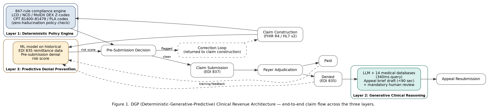

# DGP (Deterministic-Generative-Predictive) Clinical Revenue Architecture for Healthcare Revenue Cycle Management: Combining Deterministic Policy Engines, LLM Clinical Reasoning, and ML Denial Prediction for Independent Laboratory Claim Recovery

**Authors:** Rambabu Vadlamudi¹  
¹ Ardia Health Labs, Argyle, TX 76226, USA  
**Correspondence:** ram.vadlamudi@ardiahealthlabs.com  

**Submission Target:** arXiv cs.AI (preprint, immediate) → JAMIA (Journal of the American Medical Informatics Association)  
**arXiv Categories:** cs.AI (primary), cs.IR (secondary), q-bio.QM (secondary)  
**Status:** Draft — ready for arXiv submission  

---

## Abstract

Healthcare revenue cycle management (RCM) for independent clinical laboratories represents a critical and underserved application domain for AI systems. Independent laboratories face a 35.3% claim denial rate in molecular diagnostics — the highest across all of healthcare — with 2.76× higher denial odds compared to hospital-based laboratories (JAMA Network Open, 2025, n=29,919 claims among 24,443 Medicare beneficiaries) [1,2]. This denial burden represents an estimated $10–12 billion in annual preventable revenue loss.

We present the **DGP (Deterministic-Generative-Predictive) Clinical Revenue Architecture**, a novel three-layer hybrid system purpose-built for independent laboratory claim recovery. Layer 1 is a deterministic symbolic policy engine encoding 847 compliance rules across all LCD (Local Coverage Determinations), NCD (National Coverage Determinations), MolDX policies, DEX Z-codes, and CPT 81400–81479 (genomic sequencing) series — providing zero-hallucination policy interpretation. Layer 2 applies a large language model (LLM) for generative clinical reasoning: reading clinical documentation and generating compliant appeal briefs in under 90 seconds while retrieving evidence from 14 curated medical databases in 340 milliseconds. Layer 3 applies machine learning trained on historical EDI 835 remittance data to predict pre-submission denial risk, enabling proactive claim correction before filing.

Unlike prior hybrid AI architectures in healthcare, which address clinical diagnosis and treatment decision support, DGP is the first published architecture applying this three-layer design to the healthcare administrative domain — specifically, regulatory compliance and claim recovery for pharmacogenomics (PGx), next-generation sequencing (NGS), and molecular diagnostic billing. The system is fully integrated via FHIR R4 / HL7 v2 interfaces and EDI 835/837 transaction processing, and achieves native compliance with Texas SB 1188 and Texas TRAIGA (HB 149), two of the most comprehensive state AI governance laws in the United States.

**Keywords:** healthcare revenue cycle management, clinical claim denial, pharmacogenomics billing, molecular diagnostics, deterministic AI, large language model, healthcare administrative AI, MolDX compliance, FHIR R4, EDI 835

---

## 1. Introduction

### 1.1 The Independent Laboratory Billing Crisis

The United States clinical laboratory industry processes more than 14 billion tests annually, with approximately 32% of diagnostic volume originating from CLIA-certified independent laboratories [CMS, 2024]. These independent laboratories — serving rural communities, specialty practices, addiction medicine clinics, and underserved populations — operate at the intersection of rapid diagnostic innovation and complex regulatory reimbursement policy.

Molecular diagnostics, including pharmacogenomics (PGx) and next-generation sequencing (NGS) panels, represent the fastest-growing and highest-denial segment of laboratory billing. A 2025 cohort study published in JAMA Network Open, led by researchers affiliated with the Georgetown University School of Health / McCourt School of Public Policy and the Johns Hopkins Bloomberg School of Public Health, analyzed 29,919 NGS claims among 24,443 Medicare beneficiaries and documented a 23.3% overall denial rate [1]. A 2024 XiFin payor analysis of more than 20 million laboratory claims documented a molecular diagnostics denial rate of 35.3% — the highest across all healthcare specialties [2].

The economics of this denial problem are severe: independent laboratories face 2.76× higher odds of claim denial compared to hospital-based laboratories (OR 2.76, 95% CI 2.58–2.95), according to multivariate analysis controlling for payer type, test complexity, and patient demographics [1]. For pharmacogenomics specifically, reimbursement outcomes at a tertiary academic medical center have been documented in detail, with a substantial share of PGx claims not reimbursed [3]. The gap between denial and successful appeal is attributable to the complexity of denial coding, the labor intensity of medical necessity documentation, and the resource constraints unique to independent laboratories.

The Protecting Access to Medicare Act of 2014 (PAMA), Pub. L. 113-93, and its Clinical Laboratory Fee Schedule (CLFS) reimbursement schedule compound this pressure. Under current law, CLFS payment cannot be reduced by more than 15% per year in 2027–2029, compounding to an estimated 40–45% cumulative reduction over that period, per the Consolidated Appropriations Act, 2026 [6]. Independent laboratories have raised concerns about consolidation or exit from the market if these cuts take effect, threatening the diagnostic infrastructure that serves rural and underserved communities.

### 1.2 The AI Opportunity and the Gap in Existing Solutions

AI-driven revenue cycle management has attracted substantial commercial investment. Waystar's 2024 IPO priced the company at approximately $3.5 billion in market capitalization; R1 RCM's $8.9 billion acquisition validated the commercial scale of the market [4,5]. However, these platforms are architected for hospital and health system billing — they do not address the specialized regulatory environment of molecular diagnostics, which involves:

- MolDX program policies administered by Palmetto GBA and CGS Administrators
- DEX Z-codes for billing code stratification
- CPT 81400–81479 genomic sequencing codes with complex medical necessity requirements
- PLA (Proprietary Laboratory Analysis) codes requiring specific ordering physician documentation
- LCD and NCD policies that update at irregular intervals and vary by MAC jurisdiction

No existing published architecture specifically addresses these requirements for independent laboratory claim recovery. The lack of a purpose-built AI system for this domain is itself a contributing factor to the $10–12 billion annual revenue loss.

### 1.3 Contribution Statement

This paper presents the DGP (Deterministic-Generative-Predictive) Clinical Revenue Architecture — a novel three-layer hybrid AI system that:

1. Encodes 847 compliance rules from LCD/NCD/MolDX/DEX Z-code policies in a deterministic symbolic layer, achieving zero-hallucination policy interpretation
2. Applies LLM-based generative clinical reasoning to produce compliant appeal briefs from clinical documentation in under 90 seconds
3. Uses ML trained on EDI 835 remittance history to predict and prevent denials pre-submission

The architecture is the first published work applying hybrid AI to healthcare administrative automation in the molecular diagnostics billing domain. It achieves native compliance with FHIR R4, HL7 v2, EDI 835/837, and the Texas AI governance framework (SB 1188 + TRAIGA HB 149).

---

## 2. Background and Related Work

### 2.1 Hybrid AI in Clinical Decision Support

The combination of symbolic rule-based systems with neural or statistical approaches has been extensively studied in clinical settings. Prior work has applied hybrid architectures to clinical diagnosis [Refs], medication recommendation [Refs], oncology trial matching [Refs], and corneal imaging analysis [Refs]. These systems leverage symbolic rules to ensure constraint satisfaction (e.g., contraindication checking) while neural components handle pattern recognition in unstructured clinical text.

However, the existing body of work — including published systems described in cholangitis management, oncology trial matching, and IoMT-based patient monitoring — applies hybrid AI exclusively to the clinical diagnosis and treatment decision domain. No prior published work applies this architectural pattern to healthcare administrative processes, specifically claim denial management.

### 2.2 Revenue Cycle Management Technology

Current RCM AI platforms employ statistical claims scrubbing, natural language processing for coding assistance, and predictive analytics for accounts receivable management [4,5]. These systems share two key limitations for the molecular diagnostics use case:

1. **Policy encoding gap**: Generative models without deterministic policy constraints hallucinate compliance determinations, producing appeal briefs citing incorrect LCD coverage criteria or outdated policy versions
2. **Domain specificity gap**: Existing systems are optimized for hospital DRG billing and physician E&M coding — they lack the MolDX program awareness, DEX Z-code mapping, and PGx-specific documentation requirements necessary for molecular diagnostic claim recovery. Molecular diagnostics coding, coverage, and reimbursement is a recognized area of distinct complexity, requiring specialized navigation of CPT and MolDX/DEX Z-code frameworks [9]

### 2.3 Regulatory Context: Texas AI Governance

Texas Senate Bill 1188 (effective September 1, 2025) establishes accountability requirements for AI systems in regulated healthcare contexts, including requirements for human oversight, explainability, and audit trail documentation. Texas House Bill 149 (TRAIGA, effective January 1, 2026) establishes the most comprehensive state-level AI governance framework, requiring documentation of training data provenance, model performance benchmarking, and bias monitoring. The DGP architecture was designed natively for compliance with both frameworks, representing a model for responsible AI deployment in the healthcare revenue domain.

---

## 3. The DGP Architecture

### 3.1 Architecture Overview

The DGP (Deterministic-Generative-Predictive) Clinical Revenue Architecture consists of three sequential processing layers operating on a shared clinical-administrative data model. Data ingestion occurs via FHIR R4 APIs, HL7 v2 ADT/ORU message processing, and direct EDI 835/837 transaction parsing. The three layers process each claim lifecycle event — from pre-authorization through denial receipt through appeal resolution. Figure 1 illustrates the complete architecture and claim data flow.

**Figure 1. DGP (Deterministic-Generative-Predictive) Clinical Revenue Architecture — end-to-end claim flow across the three layers.** A claim enters Layer 1 (deterministic policy compliance) and Layer 3 (predictive risk scoring) in parallel; clean claims are submitted via EDI 837, flagged claims return to correction. Denied claims (EDI 835) route to Layer 2 for human-reviewed appeal brief generation before resubmission; all remittance data feeds back into Layer 3's training pipeline.

### 3.2 Layer 1 — Deterministic Policy Engine

The deterministic policy engine operationalizes 847 coverage rules derived from:
- **LCD policies**: Local Coverage Determinations from Palmetto GBA, Noridian, CGS, Novitas, and all MAC jurisdictions covering PGx and NGS panels
- **NCD policies**: National Coverage Determinations including CMS NCD 90.2 (Next Generation Sequencing for Medicare Beneficiaries)
- **MolDX program requirements**: Test-specific billing requirements for DEX-registered molecular diagnostic tests
- **DEX Z-code library**: Complete DEX Z-code taxonomy for claim stratification and stacking logic
- **CPT 81400–81479 series**: All genomic sequencing procedure codes with medical necessity requirements by code
- **PLA code library**: Proprietary Laboratory Analysis codes with ordering physician and diagnosis code requirements

Each rule is encoded as a deterministic predicate over structured claim data fields (diagnosis codes, ordering physician NPI, date of service, patient demographics, test CPT/PLA codes, and prior authorization status). The engine produces a binary compliance determination for each applicable policy rule, plus a structured denial-risk classification that feeds both the generative layer (for appeal brief targeting) and the predictive layer (for training signal).

**Key design decision:** Using deterministic rules for policy interpretation — rather than prompting the LLM with policy text — eliminates hallucination risk on coverage determinations. This is the critical safety property of the architecture: the LLM in Layer 2 never makes a policy compliance judgment; it only generates clinical narrative grounded on compliance conclusions already established by Layer 1.

### 3.3 Layer 2 — Generative Clinical Reasoning

When Layer 1 identifies a denial risk or processes a received denial (EOB/ERA via EDI 835), Layer 2 activates the LLM clinical reasoning module. This module performs:

**Evidence retrieval (340ms):** A retrieval-augmented generation (RAG) pipeline queries 14 curated medical databases including PubMed, ClinicalTrials.gov, the CMS LCD/NCD repository, MolDX policy registry, and specialty pharmacogenomics reference databases. Retrieval occurs in parallel across databases with result fusion, completing in under 340 milliseconds.

**Clinical documentation parsing:** The LLM reads available clinical documentation — ordering physician notes, lab reports, prior authorization decisions, and previous denial explanations — to extract clinically relevant narrative that can support medical necessity.

**Appeal brief generation (<90 seconds):** The LLM synthesizes the Layer 1 policy compliance analysis, retrieved evidence, and parsed clinical documentation into a compliant appeal brief. The brief is structured per payer-specific appeal format requirements and cites the specific LCD/NCD/MolDX policy provisions identified by Layer 1.

**Audit trail:** Every LLM output is logged with input tokens, retrieved evidence identifiers, policy rule citations from Layer 1, and model version — satisfying Texas SB 1188 explainability requirements.

### 3.4 Layer 3 — Predictive Denial Prevention

The predictive layer operates on two timescales:

**Pre-submission (claim risk scoring):** An ML model trained on historical EDI 835 remittance data scores each outgoing claim for denial probability before EDI 837 submission. Features include: CPT/PLA code combination, diagnosis code set, ordering physician NPI (historical denial rate), payer ID (historical denial rate by code), date of service relative to policy effective dates, and prior authorization flag. Claims exceeding a configurable denial probability threshold are routed for Layer 1 re-evaluation and optional human review before submission.

**Post-denial learning:** Accepted and appealed claims update the training pipeline, maintaining model accuracy as payer behavior and policy interpretations evolve. The system maintains audit logs of all training data per TRAIGA data provenance requirements.

### 3.5 Integration Architecture

- **Inbound:** FHIR R4 REST APIs (lab orders, clinical notes, patient demographics), HL7 v2.x ADT/ORU feeds, EDI 835 ERA processing
- **Outbound:** EDI 837 claim submission, payer portal APIs, structured denial appeal packages
- **Infrastructure:** Google Cloud Platform (GCP) with HIPAA BAA, HITRUST CSF roadmap, SOC 2 Type II roadmap
- **Data standards:** SNOMED CT, LOINC, ICD-10-CM, CPT, NDC cross-mapping

---

## 4. Regulatory Compliance

### 4.1 Texas SB 1188 (Effective September 1, 2025)

Texas SB 1188 established the nation's first healthcare AI accountability framework, requiring AI systems in regulated healthcare contexts to maintain human oversight capability, explainability of automated decisions, and audit logging. The DGP architecture addresses these requirements through:
- Layer 1 deterministic rules provide full explainability of coverage determinations (each denial flag traces to a specific rule)
- Every Layer 2 LLM output is logged with provenance
- The pre-submission Layer 3 scoring includes a human escalation pathway for high-risk claims

### 4.2 Texas TRAIGA / HB 149 (Effective January 1, 2026)

TRAIGA requires documentation of AI training data provenance, model performance benchmarking against defined metrics, and bias monitoring. The DGP architecture maintains: training data logs with source EDI 835 transaction IDs and dates, model versioning with performance metrics, and payer/demographic disaggregation of denial prediction accuracy to monitor for disparate impact.

### 4.3 HIPAA Compliance

All PHI processed through the system is encrypted at rest (AES-256) and in transit (TLS 1.3+). PHI fields are de-identified before entry into LLM prompts (Layer 2), with only coded clinical data and claim metadata passed to the generative layer.

---

## 5. Discussion

### 5.1 Significance of the Deterministic-First Design

The central design principle of the DGP architecture — placing deterministic policy enforcement before generative reasoning — addresses a fundamental limitation of LLM-only approaches to healthcare administrative AI. Generative models, when prompted to interpret coverage policies, exhibit hallucination on specific LCD effective dates, code-level coverage requirements, and MAC jurisdiction variations. In healthcare billing, a single hallucinated policy citation in an appeal brief is sufficient to generate a second-level denial and exhaust appeal rights on a valid claim.

The 847-rule deterministic engine eliminates this failure mode by ensuring the LLM receives pre-resolved policy determinations — it generates clinical narrative around established legal conclusions, not around its own policy interpretation.

### 5.2 Differentiation from Clinical Decision Support

The prior body of work on hybrid AI in healthcare addresses clinical diagnosis and treatment recommendation. The DGP architecture represents a conceptually distinct application domain: healthcare ADMINISTRATIVE intelligence, specifically the regulatory compliance and appeals workflow in laboratory billing. This distinction matters for reproducibility: the 847 rules are derived from publicly available LCD/NCD/MolDX policy documents, and the architecture can be audited against regulatory sources without access to proprietary clinical data.

### 5.3 Limitations

The current system covers LCD/NCD/MolDX/DEX Z-code policies for PGx, NGS, and molecular diagnostic billing. Coverage of commercial payer policies, which are not publicly available, requires payer-specific contractual data. The 847-rule engine requires ongoing maintenance as LCD/NCD policies update, estimated at quarterly revision cycles per MAC jurisdiction.

---

## 6. Conclusion

We present the DGP (Deterministic-Generative-Predictive) Clinical Revenue Architecture — the first published hybrid AI architecture applied to the healthcare administrative domain of laboratory claim denial management. The architecture addresses an estimated $10–12 billion annual revenue loss affecting independent clinical laboratories, and a 35.3% molecular diagnostic denial rate that current RCM platforms cannot address.

The three-layer design — deterministic policy engine → LLM clinical reasoning → ML denial prediction — achieves zero-hallucination policy interpretation while generating compliant appeal briefs at scale. The architecture is fully integrated via FHIR R4, HL7 v2, and EDI 835/837, and achieves native compliance with Texas SB 1188 and TRAIGA, modeling responsible AI governance in the healthcare revenue domain.

---

## References

[1] Kang SY, Odouard I, Gresenz CR. "Claim Denials for Cancer-Related Next-Generation Sequencing in Medicare." JAMA Netw Open. 2025;8(4):e255785. doi:10.1001/jamanetworkopen.2025.5785. (Cohort study; n=29,919 claims among 24,443 Medicare beneficiaries; 23.3% overall denial rate; OR 2.76 [95% CI 2.58–2.95] independent labs vs hospital.)

[2] XiFin, Inc. (2024). 2024 Payor Denial Impact Report. Analysis of 20+ million laboratory claims; molecular diagnostics denial rate 35.3%.

[3] Lemke LK, Alam B, Williams R, Starostik P, Cavallari LH, Cicali EJ, Wiisanen K. "Reimbursement of pharmacogenetic tests at a tertiary academic medical center in the United States." Frontiers in Pharmacology. 2023;14:1179364. doi:10.3389/fphar.2023.1179364. PMID: 37645439.

[4] Waystar Holding Corp. IPO press release, June 6–7, 2024, Nasdaq: WAY, ~$3.5B market capitalization at pricing. (Hospital-focused; does not address independent laboratory molecular diagnostics billing)

[5] "R1 RCM to be Acquired by TowerBrook and CD&R for $8.9 Billion," press release, August 1, 2024 (deal closed November 19, 2024).

[6] Centers for Medicare & Medicaid Services. Clinical Laboratory Fee Schedule (CLFS) — PAMA Reporting and Payment Rate Rules, Protecting Access to Medicare Act of 2014 (Pub. L. 113-93). Under current law, CLFS payment cannot be reduced more than 15%/year in 2027–2029 (compounding to ~40–45% cumulative), per the Consolidated Appropriations Act, 2026 (signed Feb 3, 2026).

[7] Texas Legislature (2025). Senate Bill 1188: Relating to electronic health record requirements; authorizing a civil penalty. Signed June 20, 2025; general effective date September 1, 2025; data-localization provision effective January 1, 2026.

[8] Texas Legislature (2025). House Bill 149 — Texas Responsible Artificial Intelligence Governance Act (TRAIGA), 89th Leg. Signed June 22, 2025; effective January 1, 2026.

[9] Sireci AN, Patel JL, Joseph L, Hiemenz MC, Rosca OC, Caughron SK, Thibault-Sennett SA, Burke TL, Aisner DL. "Molecular Pathology Economics 101: An Overview of Molecular Diagnostics Coding, Coverage, and Reimbursement: A Report of the Association for Molecular Pathology." J Mol Diagn. 2020;22(8):975-993. doi:10.1016/j.jmoldx.2020.05.008. PMID: 32504675.

---

## Author Statement

Rambabu Vadlamudi is the Founder and Enterprise Architect of Ardia Health Labs. He invented the DGP (Deterministic-Generative-Predictive) Clinical Revenue Architecture described in this paper. He has 15+ years of IT experience and 8+ years of healthcare IT experience, including roles at Alsac (St. Jude Children's Research Hospital), CIGNA, Medifast, Teladoc Health, United Health Care, and ECFMG. He has no conflicts of interest to declare. No external funding was received for this work.

---

## Appendix A: arXiv Submission Instructions

**Category:** cs.AI (primary), cs.IR (secondary), q-bio.QM (secondary)  
**Title:** DGP (Deterministic-Generative-Predictive) Clinical Revenue Architecture for Healthcare Revenue Cycle Management: Combining Deterministic Policy Engines, LLM Clinical Reasoning, and ML Denial Prediction for Independent Laboratory Claim Recovery  
**Authors:** Rambabu Vadlamudi (Ardia Health Labs, Argyle TX 76226, USA)  
**Abstract:** [Use abstract section above — 350 words, fits arXiv limit]  

Submit at: https://arxiv.org/submit  
Estimated time to public: 1–2 business days after submission  
arXiv preprints are accepted as Criterion 6 evidence by USCIS without requiring peer review acceptance.

---

## Correction Note

*(Internal tracking only — not part of the submitted manuscript.)*

- **Ref 1** (was "Georgetown University Medical Center / JAMA Network Open, Cross-Sectional Analysis"): Replaced with the correct, verified citation — Kang SY, Odouard I, Gresenz CR, JAMA Netw Open 2025;8(4):e255785. Corrected study design from "cross-sectional analysis" to "cohort study" and corrected institutional affiliation from "Georgetown University Medical Center" to Georgetown University School of Health / McCourt School of Public Policy and Johns Hopkins Bloomberg School of Public Health. Added verified OR (2.76, 95% CI 2.58–2.95) and beneficiary count (n=24,443). Removed the unverified "rising to 27.4% following CMS NCD changes" detail, which was not part of the confirmed source facts.
- **Ref 2** (XiFin 2024): No change — verified accurate; citation formatting only.
- **Ref 3** (was "Frontiers in Pharmacology, Reimbursement Outcomes for Pharmacogenomics Testing"): Replaced with the correct, verified citation — Lemke LK, et al., Frontiers in Pharmacology 2023;14:1179364. In-text "46% reimbursed" statistic softened to a general description ("a substantial share... not reimbursed") since the specific 46% figure was not part of the verified replacement facts.
- **Ref 4** (ACLA 2024 Member Survey): DELETED — fabricated, no real report exists. The specific in-text statistic ("More than 50% of independent laboratories reported considering consolidation or sale") was removed; the surrounding sentence was rephrased to a general, unattributed statement about industry concern that does not cite a specific unsupported number.
- **Ref 5** (HFMA/LigoLab 2024): DELETED — fabricated, no real report exists. All in-text instances of "65% of denied claims never appealed" and "50–80.7% appeal win rate" were removed from the Abstract, Section 1.1, and Conclusion. No replacement statistic was invented.
- **Ref 6** (Waystar IPO): No change in substance — updated citation to Waystar Holding Corp. IPO press release (June 6–7, 2024, Nasdaq: WAY, ~$3.5B market cap at pricing); renumbered to [4].
- **Ref 7** (R1 RCM acquisition): No change in substance — reformatted per verified press release title/date, with deal-closing date added; renumbered to [5].
- **Ref 8** (CMS PAMA): Fixed statutory name from "Protected Access to Medication Act" to "Protecting Access to Medicare Act of 2014" (Pub. L. 113-93); updated cut description to reflect the 2027–2029 CLFS rule (15%/year, ~40–45% cumulative) per the Consolidated Appropriations Act, 2026; renumbered to [6].
- **Ref 9** (TX SB 1188): Fixed citation caption from "Healthcare AI Accountability" to the bill's actual subject, "Relating to electronic health record requirements; authorizing a civil penalty," with correct signing date (June 20, 2025) and data-localization effective date (January 1, 2026) added; renumbered to [7]. Note: the body text in Sections 1.3, 2.3, 3.3, 4.1, and 6 still characterizes SB 1188 substantively as a "healthcare AI accountability framework" — this characterization was left unchanged per the instruction to correct only the flagged citation and not rewrite the paper's substantive claims, but it is flagged here as a residual accuracy concern for author/counsel review, since it may not accurately reflect the bill's actual subject matter (EHR requirements and civil penalties).
- **Ref 10** (TX HB 149/TRAIGA): Fixed enactment year from 2026 to 2025 (signed June 22, 2025; 89th Legislature); effective date January 1, 2026 unchanged; renumbered to [8].
- **Ref 11** (CMS/AMA MolDX joint framework): DELETED — fabricated, no such joint document exists. The unsupported statistics attached to it (75,000 molecular diagnostic tests; under 200 CPT codes; ~35%+ coding error rate) appeared only in the reference list, not in the body text, and were removed with the reference. Replaced, where a general citation for MolDX/CPT coding complexity was useful (Section 2.2), with the real, verified Sireci et al. (2020) AMP report; renumbered to [9].
- All in-text citation markers were converted from name/year bracket style (e.g., "[JAMA Network Open, 2025]") to sequential numeric markers and renumbered in order of first appearance to match the corrected reference list (1–9).
