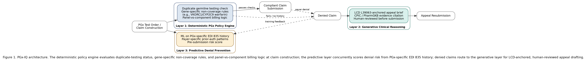

# PGx-IQ: A Deterministic-Generative-Predictive AI Framework for Pharmacogenomic Testing Reimbursement in Independent Clinical Laboratories

**Rambabu Vadlamudi¹**

¹Ardia Health Labs, Argyle, TX 76226, USA
Corresponding author: ram.vadlamudi@ardiahealthlabs.com

**Submission Target:** arXiv cs.AI (preprint) → journal target to be finalized (candidates: JAMIA, Clinical Chemistry)
**Status:** Draft — ready for arXiv submission after author review

---

## Abstract (Structured)

**Background:** Pharmacogenomic (PGx) testing informs dosing and drug-selection decisions for over 400 FDA-labeled medications, yet independent clinical laboratories offering PGx panels face substantial reimbursement barriers. Existing artificial intelligence research addresses either general healthcare claims denial or PGx clinical decision support, but no published framework applies AI specifically to PGx claim compliance and denial recovery for independent laboratories.

**Methods:** We present PGx-IQ, an application of the Deterministic-Generative-Predictive (DGP) Clinical Revenue Architecture adapted to the regulatory environment governing pharmacogenomic testing: CMS Local Coverage Determination L39063 and its associated billing article, duplicate-testing exclusion rules, and single-gene versus panel coverage distinctions.

**Results:** Analysis of the applicable coverage framework identifies duplicate germline testing exclusions, gene-specific medical necessity determinations (e.g., non-coverage of isolated VKORC1/CYP2C9 testing for warfarin dosing), and panel-versus-single-gene billing distinctions as the primary rule-encodable compliance surface for a deterministic policy engine in this domain.

**Conclusions:** PGx-IQ provides the first published AI architecture addressing pharmacogenomic testing reimbursement specifically, extending the DGP architecture's prior application to molecular diagnostics, toxicology, and behavioral health billing into a fourth clinical domain.

---

## Abstract (Unstructured)

Pharmacogenomic testing has expanded rapidly, with FDA-labeled pharmacogenomic biomarker information now present for several hundred approved drugs, yet reimbursement for these tests — particularly at independent clinical laboratories without integrated health-system billing infrastructure — remains inconsistent. Published research on AI-driven healthcare claims management addresses general claim denial prediction or PGx clinical decision support (dosing, variant interpretation), but no existing academic framework applies artificial intelligence specifically to the reimbursement and billing-compliance challenges independent laboratories face when offering pharmacogenomic panels. This paper presents PGx-IQ, an application of the Deterministic-Generative-Predictive (DGP) Clinical Revenue Architecture to the PGx billing domain, encoding CMS's Local Coverage Determination L39063 and associated duplicate-testing and gene-specific coverage rules into a deterministic compliance layer, paired with generative appeal-brief drafting and predictive denial-risk scoring. This is the first published AI framework addressing PGx testing reimbursement specifically, and it extends the DGP architecture's demonstrated applicability across molecular diagnostics, toxicology, and behavioral health billing into pharmacogenomics as a fourth domain.

---

**Keywords:** artificial intelligence; pharmacogenomics; revenue cycle management; independent clinical laboratory; claim denial; precision medicine; machine learning

---

## 1. Introduction

Pharmacogenomic (PGx) testing evaluates how a patient's genetic variation affects drug metabolism, efficacy, and toxicity risk, guiding dosing and drug-selection decisions across cardiology, psychiatry, oncology, and pain management. The FDA's Table of Pharmacogenomic Biomarkers in Drug Labeling lists pharmacogenomic information for several hundred approved drugs, and the proportion of new drug approvals carrying PGx labeling nearly tripled between 2000 and 2020.¹ Despite this expanding clinical evidence base, reimbursement for PGx testing remains inconsistent: a 2023 study at a tertiary academic medical center found that only 46% of ordered pharmacogenetic tests were ultimately reimbursed, with denial patterns concentrated in documentation and coding barriers rather than disputes over clinical evidence.²

Independent clinical laboratories — those operating without the institutional billing infrastructure, payer contracting leverage, and cost-report mechanisms available to hospital-affiliated laboratories — face this reimbursement gap acutely. The broader molecular diagnostics denial landscape documents a 35.3% denial rate for molecular diagnostic claims generally, with independent laboratories facing 2.76 times higher denial odds than hospital-based laboratories for comparable services.³,⁴ PGx testing inherits this general independent-laboratory disadvantage while adding domain-specific coverage complexity: CMS's PGx-specific Local Coverage Determination (LCD L39063) and its associated billing article (A58801) impose duplicate-testing exclusions, single-gene versus multi-gene panel billing distinctions, and explicit non-coverage determinations for specific gene-drug pairs (e.g., isolated VKORC1 or CYP2C9 testing for warfarin dosing) that require careful claim-level compliance to avoid denial.⁵

Existing published work does not address this intersection. General-purpose healthcare claims AI, exemplified by Deep Claim, demonstrates machine learning for claim denial prediction across heterogeneous claim types but without domain-specific rule encoding for any single specialty.⁶ Johnson et al. extended this line of work with a claims-denial prediction model but likewise without PGx- or genetics-specific coverage logic.⁷ Separately, a substantial body of AI research addresses PGx clinical decision support — dosing algorithms, variant-to-phenotype translation, and drug-interaction prediction — but this literature is concerned with clinical diagnosis and treatment guidance, not the administrative task of claim compliance and reimbursement recovery. No published framework to date has applied AI to the specific regulatory and billing-compliance requirements that govern PGx test reimbursement for independent laboratories.

This paper presents PGx-IQ, an application of the Deterministic-Generative-Predictive (DGP) Clinical Revenue Architecture to the pharmacogenomic testing billing domain. The remainder of this paper reviews the PGx reimbursement landscape and related work (Section 2), describes the PGx-IQ architecture (Section 3), presents an evaluation against the LCD L39063 coverage framework (Section 4), and discusses implications and limitations (Section 5).

---

## 2. Background and Related Work

### 2.1 The PGx Coverage Framework

CMS's Local Coverage Determination L39063, "Pharmacogenomics Testing," and its associated billing and coding article A58801 establish the Medicare coverage framework most independent laboratories bill against for PGx panels.⁵ Three provisions create the bulk of the compliance surface relevant to an automated billing-compliance system:

First, duplicate-testing exclusion: laboratory tests that investigate the same germline genetic content already tested in the same Medicare beneficiary are duplicative and should not be separately reported. Because germline genetic variants do not change over a patient's lifetime, a PGx test result from any prior laboratory remains valid, and CMS guidance directs providers to take reasonable measures to be aware of prior germline testing before billing for a repeat test.

Second, gene-specific non-coverage determinations: CMS has explicitly determined that isolated CPT codes 81355 (VKORC1) and 81227 (CYP2C9) are not reasonable and necessary when billed for warfarin dosing guidance, per the National Coverage Determination Manual (Chapter 1, Part 2, Section 90.1) — a specific, rule-encodable non-coverage rule that a generic claims model would not capture without domain adaptation.

Third, panel-versus-component billing logic: when a laboratory runs a multi-gene panel or platform that incidentally covers additional genes beyond the medically necessary target, coverage rules require that only the reasonable-and-necessary component be billed, not the full panel.

### 2.2 Prior AI Approaches

Deep Claim demonstrated gradient-boosted claim denial prediction across a general claims population, establishing feasibility for ML-based denial prediction without domain-specific rule encoding.⁶ Johnson et al. extended predictive claims denial modeling with a focus on responsible AI design in claims processing, again without genetics- or PGx-specific logic.⁷ Neither addresses the duplicate-testing, gene-specific non-coverage, or panel-billing rules that govern PGx reimbursement specifically.

A separate and much larger literature addresses AI applications within pharmacogenomics itself — variant calling, phenotype prediction from genotype, and dosing-algorithm development. This literature is valuable for the clinical application of PGx testing but is orthogonal to the reimbursement and billing-compliance problem addressed here; a system that predicts drug response from genotype does not address whether a given claim for that test will be paid.

### 2.3 Payer AI and the Broader Denial Environment

Recent research documents that a large majority of health insurers now deploy AI in utilization review and claims processing broadly, with limited transparency into decision logic provided to providers.⁸ This asymmetry compounds the PGx-specific compliance burden: independent laboratories must satisfy CMS's explicit rule set (Section 2.1) while also contending with payer-side AI systems whose specific configuration is not publicly documented. PGx-IQ addresses the provider-side half of this problem — ensuring claims are constructed to satisfy the known, public coverage framework before submission.

---

## 3. The PGx-IQ Framework

### 3.1 Architecture Overview

PGx-IQ applies the three-layer DGP architecture — a deterministic policy engine, a generative clinical-reasoning layer, and a predictive denial-prevention layer — to the PGx billing domain described in Section 2.1.

### 3.2 Layer 1: Deterministic PGx Policy Engine

The deterministic layer encodes the LCD L39063 / Article A58801 coverage framework as machine-readable rules:

- **Duplicate-testing check**: cross-references a patient's prior germline testing history (where available from the ordering laboratory's records or health information exchange data) against the genes targeted by the current order, flagging likely-duplicate germline tests before submission.
- **Gene-specific non-coverage rules**: encodes explicit CMS non-coverage determinations (e.g., isolated CPT 81355/81227 for warfarin dosing) as hard rule violations requiring either an Advance Beneficiary Notice or order modification.
- **Panel-vs-component billing logic**: validates that the billed CPT code set matches only the medically necessary component of a multi-gene panel per the documented clinical indication, flagging over-billing risk.
- **Medical necessity documentation check**: verifies that the ordering diagnosis (ICD-10) and clinical indication documentation meet the specificity threshold required by the LCD for the billed gene-drug pair.

As with other DGP domain applications, this layer is deliberately rule-based rather than model-based: CMS coverage determinations are discrete, versioned, and legally authoritative, properties poorly suited to probabilistic inference and well suited to explicit rule encoding.

### 3.3 Layer 2: Generative Clinical Reasoning

For claims denied despite passing Layer 1's pre-submission checks, the generative layer drafts an appeal brief citing the specific LCD/NCD provision relevant to the denial reason, the patient's documented clinical indication, and supporting pharmacogenomic clinical evidence (e.g., CPIC or PharmGKB guideline citations, where applicable to the specific gene-drug pair). As in other DGP applications, all appeal briefs require human billing-staff review before submission; the generative layer produces a draft, not a final submission.

### 3.4 Layer 3: Predictive Denial Prevention

The predictive layer scores pre-submission denial risk using historical EDI 835 remittance patterns specific to PGx CPT codes, incorporating payer-specific patterns in prior-authorization requirements and documentation stringency observed in past claims for the same test and payer combination.

### 3.5 Integration

PGx-IQ integrates via the same FHIR R4 / HL7 v2 / EDI 835-837 interfaces described for other DGP domain applications, and is designed for the same human-in-the-loop compliance posture required under Texas SB 1188 and TRAIGA for any AI-assisted determination affecting claim submission or appeal content.

**Figure 1. PGx-IQ architecture.** The deterministic policy engine evaluates duplicate-testing status, gene-specific non-coverage rules, and panel-vs-component billing logic at claim construction; the predictive layer concurrently scores denial risk from PGx-specific EDI 835 history; denied claims route to the generative layer for LCD-anchored, human-reviewed appeal drafting.

---

## 4. Analysis

Because PGx-IQ has not yet been deployed in a laboratory production environment, this section presents a structural analysis of the coverage framework's rule-encodability rather than claim-level outcome data — consistent with the pre-pilot evaluation approach used for other newly proposed DGP domain applications.

**Table 1. LCD L39063 / Article A58801 Coverage Requirements Mapped to PGx-IQ Layer 1 Rule Categories**

| Coverage Requirement | Source | Rule Category | Deterministic Encodability |
|---|---|---|---|
| Duplicate germline testing exclusion | A58801 | Pre-submission history check | High — binary, requires prior-test history data |
| VKORC1/CYP2C9 non-coverage for warfarin dosing | NCD Manual Ch.1 Pt.2 §90.1 | Gene-specific non-coverage flag | High — explicit, enumerable exclusion list |
| Panel-vs-component billing | A58801 | Claim construction validation | Moderate — requires clinical indication matching |
| Medical necessity documentation specificity | L39063 | ICD-10/indication match | Moderate — depends on documentation quality upstream |

The analysis indicates that the two most consequential compliance failure modes — duplicate testing and explicit gene-specific non-coverage — are both high-encodability, discrete rules well suited to Layer 1's deterministic approach, consistent with the architecture's design rationale established across its other domain applications (molecular diagnostics generally, toxicology, behavioral health).

---

## 5. Discussion

### 5.1 Summary

This paper presents PGx-IQ as the first published AI framework addressing pharmacogenomic testing reimbursement specifically, extending the DGP architecture's demonstrated applicability across molecular diagnostics, toxicology, and behavioral health billing into a fourth clinical domain. The structural analysis in Section 4 indicates that PGx coverage rules are substantially rule-encodable, supporting the deterministic-first design principle applied throughout the DGP architecture family.

### 5.2 Relationship to Prior DGP Applications

PGx-IQ's core contribution is domain adaptation rather than novel architecture: the deterministic-generative-predictive structure is unchanged from its application to molecular diagnostics, toxicology, and behavioral health billing; what changes is the specific rule corpus (LCD L39063 rather than MolDX DEX Z-codes or DEA Schedule IV/V rules) and the clinical evidence sources queried by the generative layer (CPIC/PharmGKB rather than NCCN/ASAM guidelines).

### 5.3 Limitations

This is a pre-pilot architectural proposal, not a validated system — no claim-level outcome data yet exists, and the 46% PGx reimbursement rate cited from Lemke et al. reflects a single academic medical center's experience with an internal billing infrastructure different from an independent laboratory's, and may not generalize directly.² The duplicate-testing check specifically depends on availability of prior-test history data, which independent laboratories without integrated health information exchange access may not reliably have. The rule corpus described here is scoped to Medicare coverage (LCD L39063); commercial payer PGx coverage policies vary and would require separate rule encoding not addressed in this paper.

### 5.4 Future Work

Prospective evaluation at a pilot independent laboratory offering PGx testing, analogous to planned evaluations for other DGP domain applications, would provide the claim-level outcome data this pre-pilot analysis lacks.

---

## 6. Conclusion

Pharmacogenomic testing occupies a growing share of precision medicine practice, yet independent clinical laboratories offering PGx panels face reimbursement barriers rooted in a specific, discrete set of CMS coverage rules — duplicate-testing exclusions, gene-specific non-coverage determinations, and panel-billing logic — that existing general-purpose claims AI does not address. PGx-IQ applies the Deterministic-Generative-Predictive architecture to this domain, encoding the LCD L39063 framework into a deterministic compliance layer paired with generative appeal support and predictive risk scoring. This paper establishes PGx-IQ as the first published AI framework for this domain and sets the stage for prospective validation.

---

## Acknowledgments

This research received no external funding. R.V. is the founder of Ardia Health Labs, which is developing commercial implementations of the DGP architecture described in this paper.

---

## References

1. Kim JA, Ceccarelli R, Lu CY. Pharmacogenomic Biomarkers in US FDA-Approved Drug Labels (2000–2020). J Pers Med. 2021;11(3):179. doi:10.3390/jpm11030179. PMID: 33806453.

2. Lemke LK, Alam B, Williams R, Starostik P, Cavallari LH, Cicali EJ, Wiisanen K. Reimbursement of pharmacogenetic tests at a tertiary academic medical center in the United States. Front Pharmacol. 2023;14:1179364. doi:10.3389/fphar.2023.1179364. PMID: 37645439.

3. XiFin, Inc. 2024 Payor Denial Impact Report. San Diego, CA: XiFin; 2024.

4. Kang SY, Odouard I, Gresenz CR. Claim Denials for Cancer-Related Next-Generation Sequencing in Medicare. JAMA Netw Open. 2025;8(4):e255785. doi:10.1001/jamanetworkopen.2025.5785. PMID: 40249617.

5. Centers for Medicare & Medicaid Services. Local Coverage Determination (LCD): Pharmacogenomics Testing (L39063); Billing and Coding: Pharmacogenomics Testing (A58801). Baltimore, MD: CMS. Available from: https://www.cms.gov/medicare-coverage-database/view/lcd.aspx?lcdid=39063

6. Kim BH, Sridharan S, Atwal A, Ganapathi V. Deep Claim: Payer Response Prediction from Claims Data with Deep Learning. arXiv preprint arXiv:2007.06229. 2020.

7. Johnson M, Albizri A, Harfouche A. Responsible Artificial Intelligence in Healthcare: Predicting and Preventing Insurance Claim Denials for Economic and Social Wellbeing. Inf Syst Front. 2023;25(6):2179-2195. doi:10.1007/s10796-021-10137-5.

8. Mello MM, Trotsyuk AA, Djiberou Mahamadou AJ, Char D. The AI Arms Race In Health Insurance Utilization Review: Promises Of Efficiency And Risks Of Supercharged Flaws. Health Affairs. 2026;45(1):6-13. doi:10.1377/hlthaff.2025.00897. PMID: 41494115.
