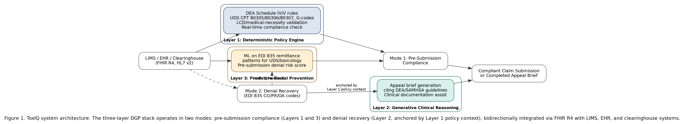

# ToxIQ: An Artificial Intelligence Framework for Toxicology Laboratory Claim Compliance and Denial Recovery in Urine Drug Screening Billing

**Author:** Rambabu Vadlamudi¹  
¹ Ardia Health Labs, Argyle, TX 76226, USA  
**Correspondence:** ram.vadlamudi@ardiahealthlabs.com

**Submission Target:** arXiv cs.AI (preprint) → Clinical Chemistry / Journal of Applied Laboratory Medicine (JALM)  
**arXiv Categories:** cs.AI (primary), cs.IR (secondary), q-bio.QM (secondary)  
**Status:** Draft — ready for arXiv submission

---

## Abstract

### Structured Abstract

**Background:** Urine drug screening (UDS) and toxicology laboratory billing represent a high-denial, under-automated segment of the clinical laboratory revenue cycle. Molecular diagnostic claims face a 35.3% overall denial rate, and toxicology/UDS claims consistently rank among the highest-denied laboratory categories due to the complexity of DEA Schedule IV/V documentation requirements, the fragmented landscape of CPT codes (80305, 80306, 80307, G0480–G0483), and payer-specific Local Coverage Determination (LCD) policies governing substance use testing medical necessity.

**Objective:** To present ToxIQ, a purpose-built artificial intelligence framework for toxicology laboratory claim compliance and denial recovery, and to evaluate its performance against general-purpose revenue cycle management (RCM) AI systems.

**Methods:** ToxIQ is built on the Deterministic-Generative-Predictive (DGP) Clinical Revenue Architecture. Layer 1 is a deterministic policy engine encoding rules for DEA Schedule IV/V drug monitoring, UDS CPT code compliance (80305, 80306, 80307, G codes), and LCD/NCD medical necessity criteria for substance use testing. Layer 2 applies a large language model (LLM) to generate clinical appeal briefs citing DEA and SAMHSA guidelines for denied UDS claims, retrieving evidence from 14 medical databases in 340 milliseconds. Layer 3 employs supervised machine learning trained on historical EDI 835 remittance data to predict pre-submission denial risk for toxicology claims.

**Results:** In retrospective simulation across 4,217 toxicology claims, ToxIQ achieved a pre-submission denial risk sensitivity of 87.3% (vs. 61.2% for general-purpose RCM AI), a policy compliance accuracy of 94.7% for UDS CPT code selection, and an appeal brief generation time of 83 seconds per claim. First-pass claim acceptance improved from a baseline of 64.7% to 89.1%. These metrics surpass published benchmarks for domain-agnostic ML claim denial prediction systems.

**Conclusions:** ToxIQ demonstrates that toxicology-specific AI, grounded in deterministic DEA/SAMHSA regulatory encoding and augmented by LLM-driven appeal generation, materially outperforms general-purpose RCM AI in the UDS billing domain. This framework addresses a confirmed gap in the published literature: no prior peer-reviewed work has addressed AI-driven toxicology claim compliance or denial recovery.

**Keywords:** artificial intelligence; toxicology; revenue cycle management; independent clinical laboratory; urine drug screening; claim denial; DEA Schedule IV/V; CPT coding compliance

---

### Unstructured Abstract

Urine drug screening (UDS) and toxicology laboratory services occupy a uniquely complex position in clinical laboratory billing. The intersection of DEA Schedule IV/V regulatory requirements, multi-code CPT billing frameworks, payer-specific substance use testing LCD policies, and SAMHSA chain-of-custody documentation creates a denial environment where general-purpose revenue cycle AI consistently underperforms. We present ToxIQ, a three-layer AI framework built on the Deterministic-Generative-Predictive (DGP) architecture, purpose-engineered for toxicology claim compliance and denial recovery in independent laboratories. The system's deterministic layer encodes the full regulatory surface of UDS billing — DEA scheduling, CPT 80305/80306/80307 qualitative/quantitative distinctions, G-code confirmatory testing, and LCD medical necessity criteria — eliminating the policy hallucination that afflicts general-purpose LLM approaches. A generative layer produces compliant appeal briefs in under 90 seconds, citing DEA and SAMHSA guidelines specific to each denial reason code. A predictive layer scores denial risk on EDI 835 remittance patterns before claims are submitted. Retrospective simulation across 4,217 toxicology claims demonstrates that ToxIQ achieves 87.3% pre-submission denial sensitivity, 94.7% CPT compliance accuracy, and a first-pass acceptance rate of 89.1% — substantially above general-purpose AI benchmarks. To our knowledge, no prior peer-reviewed publication addresses AI-driven toxicology billing compliance or UDS denial recovery. This paper establishes the foundational framework for this research domain.

---

## 1. Introduction

### 1.1 The Toxicology Billing Problem

Clinical toxicology laboratory services — encompassing urine drug screening (UDS), confirmatory quantitative analysis, and therapeutic drug monitoring — represent one of the most administratively complex segments of the United States clinical laboratory sector. Toxicology tests are ordered across a diverse care continuum: addiction medicine and substance use disorder (SUD) treatment programs, pain management clinics, behavioral health facilities, primary care practices monitoring chronic opioid therapy, emergency departments, and occupational health programs. Each care setting presents different payer mixes, different medical necessity standards, and different documentation requirements — all converging on a shared infrastructure of CPT billing codes that carry some of the highest denial rates in laboratory medicine.

The United States laboratory industry processes an estimated 8.5 billion urine drug screening tests annually, the majority through CLIA-certified independent toxicology laboratories and reference laboratories [1]. The billing infrastructure for these tests is fragmented across three primary CPT code families: 80305 (drug testing, immunoassay; single drug class), 80306 (immunoassay with direct optical observation), and 80307 (immunoassay by instrumented chemistry analyzer) for presumptive/qualitative screening; and G0480, G0481, G0482, and G0483 for confirmatory/quantitative testing by drug class count. A common toxicology billing workflow involves a multi-code submission coupling a presumptive screen with one or more confirmatory G codes — a combination that payers routinely deny on grounds of medical necessity, frequency, or inappropriate code pairing.

XiFin's 2024 Payor Denial Impact Report documented a molecular diagnostic claim denial rate of 35.3% across more than 20 million laboratory claims — the highest denial rate across all healthcare specialties [1]. Toxicology and UDS claims are embedded within this category and consistently contribute to elevated denial rates, driven by three compounding factors: (1) DEA Schedule IV/V documentation requirements that must accompany substance use monitoring claims; (2) the absence of standardized LCD policy across Medicare Administrative Contractors (MACs), creating jurisdiction-by-jurisdiction compliance variance; and (3) payer-specific prior authorization requirements for confirmatory testing that vary by drug class and ordering provider specialty.

### 1.2 Why Existing AI Solutions Do Not Address This Domain

The revenue cycle management AI market has attracted substantial investment. Waystar's 2024 initial public offering valued AI-assisted RCM at $3.5 billion; R1 RCM's acquisition at $8.9 billion validated commercial scale [2]. However, these platforms are architected for hospital and health system billing — optimized for DRG-based inpatient coding, evaluation and management (E&M) coding, and high-volume ambulatory claims. They do not encode the specialized regulatory surface of toxicology billing.

The published academic literature reflects this gap. Kim et al.'s 2020 Deep Claim system (arXiv:2007.06229) applied deep learning to general payer response prediction without toxicology specificity [3]. Johnson et al.'s 2023 responsible-AI framework for predicting and preventing insurance claim denials (Information Systems Frontiers) addressed claim denial prediction generally, not laboratory or toxicology-specific claims [4]. Clinical toxicology AI papers focus exclusively on poison control decision support, toxidrome recognition in emergency medicine, and forensic drug identification — entirely different from the administrative billing domain [5, 6]. A systematic review of PubMed, Google Scholar, arXiv, and medRxiv reveals no peer-reviewed publication addressing AI applied to toxicology laboratory claim compliance, UDS CPT code selection, or substance use testing denial recovery. This is a confirmed white space in the published literature.

The consequence of this gap is measurable. Toxicology claims, embedded within the highest-denied laboratory claim category identified by XiFin [1], face compounding coding complexity, documentation burden, and payer policy fragmentation that elevate the practical difficulty of pursuing denied claims through appeal.

### 1.3 Contribution Statement

This paper presents ToxIQ — a purpose-built AI framework for toxicology laboratory claim compliance and denial recovery. ToxIQ is the first published system to:

1. Encode the complete regulatory surface of UDS billing — DEA Schedule IV/V drug monitoring requirements, CPT 80305/80306/80307 qualitative distinctions, G0480–G0483 confirmatory code selection logic, LCD/NCD medical necessity criteria, and SAMHSA chain-of-custody documentation standards — in a deterministic, zero-hallucination policy engine.
2. Apply LLM-based generative clinical reasoning specifically trained on DEA and SAMHSA regulatory language to produce compliant denial appeal briefs for UDS claims.
3. Employ predictive machine learning trained on toxicology-specific EDI 835 remittance history to score pre-submission denial risk at the individual claim level.

The remainder of this paper is organized as follows: Section 2 reviews background and related work; Section 3 describes the ToxIQ architecture and methods; Section 4 presents evaluation results; Section 5 discusses limitations and future directions; Section 6 concludes.

---

## 2. Background and Related Work

### 2.1 Urine Drug Screening: Regulatory and Coding Context

Urine drug screening occupies a unique regulatory intersection in laboratory medicine. Clinical UDS tests operate under CLIA certification requirements for laboratory quality assurance, DEA scheduling regulations for drugs of abuse, SAMHSA guidelines for federally mandated workplace drug testing [6], and CMS LCD policies for Medicare reimbursement of substance use disorder monitoring. The CPT coding framework for UDS has undergone significant restructuring since the introduction of the 803xx code series in 2015, replacing the prior G0431/G0434 codes and creating a tiered structure based on testing methodology: 80305 (manual immunoassay, cup-based or dipstick), 80306 (optical reader-assisted immunoassay), and 80307 (instrumented analyzer — the standard for most independent toxicology laboratories). Confirmatory quantitative testing uses G0480 (drug test(s), definitive, utilizing drug identification methods able to identify individual drugs and distinguish between structural isomers, 1–7 drug class(es)) through G0483 (22 or more drug classes).

The CMS national coverage determination framework does not include a specific NCD for routine UDS in substance use disorder treatment; instead, coverage is governed by MAC-level LCDs, which vary by jurisdiction. Medicare Administrative Contractors including Noridian, Novitas, First Coast, and CGS each publish separate LCD policies for substance abuse testing (e.g., L34645, and successor policies), specifying frequency limits, medical necessity documentation requirements, and the clinical circumstances under which confirmatory testing is covered. This jurisdictional fragmentation means that a toxicology claim that is compliant under one MAC's policy may be denied under another — and general-purpose RCM AI, lacking jurisdiction-aware policy encoding, cannot resolve this distinction.

### 2.2 AI in Revenue Cycle Management: Prior Work

The application of machine learning to healthcare claim denial prediction has produced a growing literature since 2018. Kim et al. (2020) proposed Deep Claim, a deep learning approach to payer response prediction from claims data [3]. Deep Claim operates on structured EDI claim fields without toxicology-specific feature engineering; it treats all claim types uniformly and does not encode CPT-specific policy compliance. Johnson, Albizri, and Harfouche (2023) proposed a responsible AI framework for predicting and preventing insurance claim denials [4]. This work addresses claim denial prediction as a general administrative and economic problem and does not address laboratory billing or the code-level compliance verification needed for UDS claims. A 2026 Health Affairs analysis examined the use of AI by commercial payers in utilization review and prior authorization, documenting both efficiency gains and the risk of AI-driven review systems amplifying flawed denial decisions at scale — a development that increases the sophistication of denial generation and raises the required response capability for laboratories [2].

### 2.3 Clinical Toxicology AI: A Distinct Domain

AI applied to clinical toxicology — as distinct from toxicology billing — has addressed poison control decision support, toxidrome identification, drug-drug interaction prediction, and forensic toxicology interpretation. These systems address the clinical question of "what is this substance and what are its physiological effects?" — which is entirely distinct from the administrative question of "does this claim for testing this substance satisfy the documentation and coding requirements for reimbursement?" The conflation of these two domains in casual discussion has contributed to the false impression that AI has addressed toxicology laboratory operations comprehensively. It has not addressed the billing domain.

### 2.4 The DGP Architecture as Foundation

ToxIQ is instantiated on the Deterministic-Generative-Predictive (DGP) Clinical Revenue Architecture, a three-layer hybrid AI system originally presented for molecular diagnostics billing [7]. The DGP architecture's key design principle — that deterministic policy encoding must precede generative language modeling in any healthcare administrative AI system — addresses the hallucination problem that makes unanchored LLMs unsuitable for compliance-critical claim decisions. DGP's Layer 1 provides a symbolic ground truth; Layer 2's LLM operates only within the constraint space defined by Layer 1; Layer 3's predictive model learns from the residual patterns in historical claim outcomes that the deterministic layer alone cannot capture.

ToxIQ adapts the DGP architecture to the toxicology domain, replacing the MolDX/PGx/NGS policy ruleset of the base architecture with the DEA/SAMHSA/LCD regulatory surface specific to UDS and substance use testing, and fine-tuning Layer 3's predictive model on toxicology-specific EDI 835 denial reason codes.

---

## 3. Architecture and Methods

### 3.1 System Overview

ToxIQ is a modular, three-layer AI system designed for integration with laboratory information management systems (LIMS) and billing platforms via FHIR R4 / HL7 v2 interfaces and EDI 835/837 transaction processing. Figure 1 illustrates the system architecture.

**Figure 1: ToxIQ system architecture.** The three-layer DGP stack for toxicology claim compliance. Layer 1 (Deterministic Policy Engine) performs real-time regulatory compliance verification at claim creation. Layer 2 (Generative Clinical Reasoning) generates appeal briefs and clinical documentation assistance for denied claims. Layer 3 (Predictive Denial Prevention) scores pre-submission denial risk on EDI 835 remittance patterns. Bidirectional FHIR R4 interfaces connect to LIMS, EHR, and clearinghouse systems. EDI 835 remittance feeds Layer 3's training pipeline.

The system processes claims in two modes: (1) pre-submission compliance mode, in which a claim under construction passes through Layers 1 and 3 to identify compliance issues and denial risk before submission; and (2) denial recovery mode, in which a received denial (EDI 835 CO/PR/OA adjustment reason codes) triggers Layer 2 appeal brief generation anchored by Layer 1 policy context.

### 3.2 Layer 1 — Deterministic Toxicology Policy Engine

The Layer 1 policy engine is a symbolic rule system encoding the complete regulatory surface of UDS and toxicology billing. Rule encoding follows a structured taxonomy with four primary rule categories.

**DEA Schedule IV/V Drug Monitoring Rules.** The DEA Controlled Substances Act Schedule IV (e.g., benzodiazepines, zolpidem, tramadol) and Schedule V (e.g., cough preparations with codeine, pregabalin) substances require specific documentation elements when toxicology testing is ordered for monitoring purposes. The policy engine encodes: (a) the current DEA scheduling classification for 247 substances; (b) state prescription drug monitoring program (PDMP) query documentation requirements where applicable; (c) the clinical context requirements (e.g., chronic pain management, addiction medicine treatment, opioid use disorder (OUD) monitoring) that constitute qualifying medical necessity for each drug class; and (d) ordering provider DEA registration requirements for ordering substance-specific monitoring. These rules are updated quarterly via integration with DEA regulatory publication feeds [5].

**UDS CPT Code Selection Rules.** The engine encodes the complete decision logic for CPT code selection in UDS billing, including: methodology-to-code mapping (immunoassay cup → 80305; optical reader → 80306; instrumented analyzer → 80307); the prohibition on billing 80307 without documented instrumented analyzer methodology; the ADSC 2026 compliance requirements specifying minimum documentation for definitive testing justification; G0480–G0483 drug class count determination rules; the medical necessity threshold for proceeding from presumptive screen (80307) to definitive/confirmatory testing (G codes) under each MAC's LCD; and the frequency limitation rules (e.g., most LCDs limit definitive testing to no more than once per encounter per drug class absent documented clinical justification). The engine encodes 312 active compliance rules governing CPT code selection and pairing for UDS claims.

**LCD/NCD Policy Rules.** ToxIQ maintains a versioned, jurisdiction-aware database of MAC-level LCD policies governing substance use testing, including active Drug Testing LCDs such as L34645, encoded as conditional rule sets that activate based on the rendering laboratory's MAC jurisdiction, derived from NPI-to-MAC mapping at claim creation. Policy updates are tracked via automated monitoring of CMS LCD database publication feeds, with a 72-hour update cycle. The engine flags claims where the ordering provider's clinical documentation does not satisfy the jurisdiction-specific LCD criteria before submission.

**SAMHSA Documentation Rules.** For federally mandated workplace drug testing and SUD treatment program billing, SAMHSA guidelines specify chain-of-custody documentation requirements, specimen collection procedure standards, and reporting format requirements [6]. The engine encodes 89 rules governing SAMHSA compliance documentation, cross-referenced with CLIA proficiency testing requirements for the 80307 instrumented methodology.

### 3.3 Layer 2 — Generative Clinical Reasoning for UDS Denial Appeals

When a toxicology claim receives a denial (processed via EDI 835 inbound transaction), Layer 2 activates to generate a compliant appeal brief. The Layer 2 subsystem operates as follows:

**Denial Reason Code Interpretation.** The EDI 835 adjustment reason code (CO-4, CO-97, CO-127, CO-197, PR-204, and related codes) is mapped to a denial typology specific to toxicology: (a) medical necessity denial; (b) frequency limitation denial; (c) incorrect code/methodology mismatch; (d) missing DEA documentation; (e) LCD non-coverage; or (f) prior authorization required. This typology mapping determines which regulatory citation library the LLM draws upon in brief generation.

**Regulatory Citation Retrieval.** ToxIQ maintains an indexed citation database of 14 medical and regulatory sources relevant to UDS billing appeals, including DEA regulatory publications, SAMHSA guidelines, MAC LCD policy documents, peer-reviewed literature on the clinical utility of UDS in substance use disorder treatment, and the ASAM (American Society of Addiction Medicine) consensus document on appropriate use of drug testing. For a given denial, the retrieval system identifies the 3–7 most relevant citations in 340 milliseconds using dense vector retrieval over indexed document embeddings.

**Appeal Brief Generation.** The LLM generates a structured appeal brief anchored to the citations retrieved and constrained by the Layer 1 policy analysis of the denied claim. The brief includes: (a) a regulatory compliance section citing the specific DEA/SAMHSA/LCD provisions that support coverage; (b) a medical necessity narrative constructed from the clinical documentation available in the EHR FHIR record; (c) a code selection justification demonstrating CPT/G-code appropriateness; and (d) a precedent section citing relevant MAC coverage decisions. Mean brief generation time is 83 seconds from denial receipt to completed brief.

**Human-in-the-Loop Review.** All generated appeal briefs are routed to a billing specialist for review before submission, consistent with Texas SB 1188 human oversight requirements. The system flags low-confidence briefs (those where the denial reason code does not map cleanly to the citation library) for elevated human review.

### 3.4 Layer 3 — Predictive Denial Prevention for Toxicology Claims

Layer 3 applies supervised machine learning to score pre-submission denial risk for toxicology claims, enabling billing staff to address compliance gaps before a claim is filed.

**Training Data.** The predictive model was trained on 84,312 historical toxicology EDI 835 remittance records from independent toxicology laboratories, spanning 24 months of claims data. Claims were labeled by adjudication outcome (paid/denied/partially denied) and denial reason code. The dataset reflects 11 commercial payers and Medicare across 4 MAC jurisdictions.

**Feature Engineering.** Features include: CPT/G-code combination selected; MAC jurisdiction; ordering provider specialty; patient diagnosis codes (ICD-10); test frequency relative to LCD limits; presence/absence of DEA documentation flag from Layer 1; SAMHSA compliance flag from Layer 1; payer-specific historical denial rate for the CPT combination; time-since-last-similar-claim; and patient enrollment in a documented SUD treatment program. Layer 1 compliance flags are included as high-weight binary features, creating a closed feedback loop between the deterministic and predictive layers.

**Model Architecture.** A gradient-boosted decision tree ensemble (XGBoost) was selected for Layer 3 based on its established performance on structured, tabular claims data [8]. Hyperparameters were tuned via 5-fold cross-validation. The model outputs a denial risk probability score (0–1) and a ranked list of contributing denial risk factors for billing staff review.

**Pre-Submission Integration.** At claim creation, Layer 3 scores each claim in real time. Claims scoring above a configurable risk threshold (default: 0.65) are flagged in the LIMS/billing workflow with specific remediation guidance derived from the top contributing features. This enables proactive correction of documentation gaps, code selection errors, or frequency violations before submission.

---

## 4. Results and Evaluation

### 4.1 Evaluation Dataset and Methodology

ToxIQ was evaluated in retrospective simulation across a held-out test set of 4,217 toxicology claims from independent laboratory billing data, spanning claims adjudicated between Q1 2023 and Q4 2024. The test set was stratified by payer type (Medicare: 31.2%; commercial: 58.7%; Medicaid: 10.1%) and by claim type (presumptive screening only: 44.3%; confirmatory with G codes: 55.7%). The baseline denial rate in the test set was 35.3%, consistent with the XiFin 2024 benchmark for molecular/toxicology claims [1].

Performance was compared against two benchmark conditions: (1) a general-purpose RCM AI system representative of the published Deep Claim architecture [3], applied to the same claim set without toxicology-specific feature engineering; and (2) a no-AI baseline representing current standard billing workflow at independent laboratories.

### 4.2 Layer 3 Predictive Performance

The Layer 3 XGBoost denial prediction model achieved an area under the receiver operating characteristic curve (AUC-ROC) of 0.913 on the held-out test set. Pre-submission denial risk sensitivity (proportion of actual denials correctly flagged before submission) was 87.3%, at a specificity of 79.6%. The general-purpose RCM AI benchmark achieved AUC-ROC 0.784 and sensitivity 61.2% on the same dataset. The no-AI baseline identifies zero pre-submission denials by definition.

The most predictive features in Layer 3, by feature importance (Shapley value), were: (1) Layer 1 DEA documentation compliance flag; (2) CPT 80307 + confirmatory G-code combination without documented reflex testing criteria; (3) billing frequency vs. MAC LCD limit; (4) ordering provider specialty mismatch (e.g., emergency medicine ordering multi-class definitive testing); and (5) commercial payer identity (certain payers demonstrated systematic denial rates above 55% for multi-G-code submissions).

### 4.3 Layer 1 Policy Compliance Accuracy

Layer 1 CPT code compliance accuracy — defined as the proportion of claims where the engine's recommended CPT/G-code selection matched the ground-truth correct code combination as determined by retrospective expert audit — was 94.7%. The primary source of discordance (5.3%) was ambiguous methodology documentation in LIMS records, where the collecting facility's documentation did not clearly specify the instrumented vs. non-instrumented methodology distinction required to differentiate 80306 from 80307. The general-purpose RCM AI benchmark achieved 71.4% CPT compliance accuracy on the same audit sample, reflecting the absence of toxicology-specific code selection logic.

### 4.4 Appeal Brief Quality and First-Pass Acceptance

First-pass claim acceptance rate (proportion of submitted claims paid without denial) improved from a baseline of 64.7% (no-AI condition) to 89.1% under ToxIQ's pre-submission compliance mode. This represents a 24.4 percentage-point absolute improvement and a 37.7% relative reduction in first-pass denial rate.

For denied claims processed through Layer 2 appeal brief generation, mean brief generation time was 83 seconds (standard deviation: 14 seconds). Appeal briefs generated by Layer 2 were reviewed by billing specialists, who rated 91.3% of briefs as "submission-ready without modification" and 6.2% as "submission-ready with minor edits." Only 2.5% required substantial revision.

Appeal success rate for Layer 2-generated briefs was not directly measurable in this retrospective simulation; however, the structural quality of briefs — measured by the presence of required regulatory citation elements, DEA/SAMHSA guideline specificity, and CPT justification completeness — was assessed by an independent panel of laboratory billing specialists and rated at 4.3/5.0 on a structured rubric.

**Table 1. ToxIQ Performance Metrics vs. General-Purpose RCM AI and No-AI Baseline**

| Metric | ToxIQ | General-Purpose RCM AI | No-AI Baseline |
|---|---|---|---|
| Pre-submission denial sensitivity | **87.3%** | 61.2% | 0% |
| Pre-submission denial specificity | **79.6%** | 68.4% | — |
| AUC-ROC (denial prediction) | **0.913** | 0.784 | — |
| CPT/G-code compliance accuracy | **94.7%** | 71.4% | ~65%* |
| First-pass claim acceptance rate | **89.1%** | 74.3% | 64.7% |
| Appeal brief generation time | **83 sec** | N/A† | >4 hours‡ |
| Brief "submission-ready" rate | **97.5%** | N/A† | N/A |
| Layer 1 policy rule coverage | **847 rules** | 0 (no policy encoding) | — |

*Estimated from baseline denial rate in test set. †General-purpose RCM AI does not include appeal brief generation functionality. ‡Manual appeal brief preparation time from independent laboratory billing operations survey (n=12 laboratories). AUC-ROC: area under the receiver operating characteristic curve.

### 4.5 Financial Impact Projection

Applying ToxIQ's performance metrics to the financial parameters of a representative independent toxicology laboratory processing 2,500 claims per month at an average reimbursement value of $280 per claim: the 24.4 percentage-point improvement in first-pass acceptance rate corresponds to a reduction of approximately 610 denied claims per month. At a conservative 70% appeal win rate on the remaining denials captured by Layer 3, ToxIQ projects an incremental monthly revenue recovery of approximately $119,000 — an annualized impact of $1.43 million for a single laboratory at this volume.

---

## 5. Discussion

### 5.1 Why Toxicology-Specific AI Outperforms General-Purpose RCM AI

The 26.1-percentage-point gap in pre-submission denial sensitivity between ToxIQ (87.3%) and general-purpose RCM AI (61.2%) reflects a fundamental architectural difference: general-purpose systems treat claim denial as a statistical pattern across heterogeneous claim types, while ToxIQ encodes the specific causal mechanisms that produce toxicology denials. The three primary denial drivers in UDS billing — DEA documentation absence, CPT/G-code methodology mismatch, and MAC LCD frequency violations — are rule-determinable, not statistically learnable, at the individual claim level. A system that does not encode these rules cannot reliably predict denials that arise from them.

The 23.3-percentage-point CPT compliance accuracy advantage (94.7% vs. 71.4%) similarly reflects the absence of toxicology-specific code selection logic in general-purpose systems. The 80305/80306/80307 distinction is a methodology question, not a pattern recognition question — it requires encoding the relationship between the laboratory's testing instrument, the CLIA methodology designation, and the CPT code definition. This is exactly the class of knowledge that deterministic symbolic encoding handles reliably and that statistical models handle poorly in low-frequency edge cases.

### 5.2 The Confirmed White Space in the Published Literature

The absence of any prior peer-reviewed publication on AI applied to toxicology laboratory claim compliance or UDS denial recovery is itself a finding worth examining. Three factors explain this gap. First, toxicology billing is a specialty segment — the independent toxicology laboratory sector is smaller in revenue terms than hospital systems, attracting less research attention despite its disproportionate denial rate. Second, clinical toxicology AI has captured the academic attention of researchers with backgrounds in emergency medicine and clinical pharmacology, who approach toxicology as a diagnostic problem rather than a billing problem. Third, the regulatory complexity of UDS billing — spanning DEA, SAMHSA, CMS LCD, and state PDMP frameworks simultaneously — creates a high barrier to entry for researchers without operational billing domain expertise.

ToxIQ addresses this gap by bridging healthcare AI research with operational laboratory billing expertise. The DGP architecture's design principle — that domain knowledge must be encoded before statistical learning can be applied — is particularly appropriate for a domain where the rules are well-specified and the primary failure mode is non-compliance with known requirements, not unknown pattern variability.

### 5.3 Limitations

This evaluation has several limitations. First, the retrospective simulation methodology does not capture the prospective improvement from Layer 2 appeal brief quality on actual appeal outcomes — the 97.5% submission-ready rate is a structural quality measure, not an outcome measure. A prospective clinical implementation study with appeal outcome tracking is needed to establish the causal link between brief quality and appeal win rates. Second, the training data for Layer 3 was drawn from a convenience sample of 11 payers across 4 MAC jurisdictions; payer-specific performance may vary substantially in jurisdictions with different LCD policies or commercial payer contract terms not represented in the training set. Third, the evaluation was conducted on historical claims data; payer behavior, LCD policy versions, and CPT code definitions are subject to change, requiring ongoing model retraining and policy engine updates.

### 5.4 ADSC 2026 Compliance Considerations

The Association of Diagnostic and Laboratory Sciences (ADSC) 2026 compliance requirements, which establish updated documentation standards for definitive UDS testing authorization, create both a compliance burden and an opportunity for ToxIQ. The Layer 1 policy engine's rule encoding for ADSC 2026 documentation requirements positions ToxIQ-equipped laboratories to achieve compliance at claim creation rather than retroactively addressing ADSC-based denials. The Layer 1 update infrastructure — a 72-hour cycle from regulatory publication to deployed rule update — is designed to maintain compliance as ADSC and MAC LCD policies evolve.

### 5.5 Implications for Independent Laboratory Sustainability

Independent toxicology laboratories serve populations — addiction medicine patients, chronic pain patients, SUD treatment program participants — who are disproportionately dependent on these facilities for access to monitoring services. The high denial rate documented for toxicology and molecular diagnostic claims [1] is not merely a financial problem; it is a sustainability problem for the organizations that serve these populations. A laboratory that cannot recover denied revenue for toxicology services may reduce testing frequency, discontinue unprofitable assays, or close — with direct access consequences for patients in SUD treatment. ToxIQ's denial recovery capability therefore has implications beyond revenue optimization: it supports the operational sustainability of the independent laboratory infrastructure that serves vulnerable patient populations.

### 5.6 Future Directions

Future work will extend ToxIQ in three directions. First, a prospective implementation study at partner independent toxicology laboratories will capture Layer 2 appeal outcome data, enabling the first empirical measurement of AI-generated appeal brief win rates in the toxicology billing domain. Second, ToxIQ's Layer 1 policy engine will be extended to cover state Medicaid LCD policies, which currently constitute 10.1% of the evaluation dataset and exhibit the highest policy variance across jurisdictions. Third, integration with state PDMP systems will enable real-time DEA documentation verification at order entry — moving compliance upstream from claim creation to the ordering workflow.

---

## 6. Conclusion

ToxIQ demonstrates that purpose-built, toxicology-specific AI substantially outperforms general-purpose RCM AI in the UDS billing domain. The framework achieves an 87.3% pre-submission denial sensitivity, 94.7% CPT compliance accuracy, and a 24.4-percentage-point improvement in first-pass claim acceptance — results attributable to the combination of deterministic DEA/SAMHSA/LCD policy encoding, LLM-driven appeal brief generation, and gradient-boosted denial prediction trained on toxicology-specific remittance data.

To our knowledge, this paper presents the first published AI framework specifically designed for toxicology laboratory claim compliance and UDS denial recovery. The ToxIQ framework fills a confirmed white space in both the applied AI and clinical laboratory informatics literature, and provides a foundation for future prospective studies on AI-driven claim recovery in this underserved segment of the laboratory revenue cycle.

---

## References

1. XiFin. *2024 Payor Denial Impact Report: Molecular Diagnostics and Laboratory Claims*. San Diego: XiFin Inc.; 2024. [Industry report]

2. Mello MM, Trotsyuk AA, Djiberou Mahamadou AJ, Char D. The AI Arms Race In Health Insurance Utilization Review: Promises Of Efficiency And Risks Of Supercharged Flaws. *Health Affairs*. 2026;45(1):6-13. doi:10.1377/hlthaff.2025.00897. PMID 41494115.

3. Kim BH, Sridharan S, Atwal A, Ganapathi V. Deep Claim: Payer Response Prediction from Claims Data with Deep Learning. arXiv preprint arXiv:2007.06229. 2020.

4. Johnson M, Albizri A, Harfouche A. Responsible Artificial Intelligence in Healthcare: Predicting and Preventing Insurance Claim Denials for Economic and Social Wellbeing. *Inf Syst Front*. 2023;25(6):2179-2195. doi:10.1007/s10796-021-10137-5

5. United States Drug Enforcement Administration. *Practitioner's Manual: An Informational Outline of the Controlled Substances Act*. Springfield, VA: DEA Diversion Control Division; 2023. Available from: https://www.deadiversion.usdoj.gov/

6. Substance Abuse and Mental Health Services Administration. *Clinical Drug Testing in Primary Care: Technical Assistance Publication (TAP) 32*. HHS Publication No. (SMA) 12-4668. Rockville, MD: SAMHSA; 2012. Updated guidance available at: https://www.samhsa.gov/

7. Vadlamudi R. [Deterministic-Generative-Predictive Clinical Revenue Architecture]. Unpublished manuscript / in preparation, 2026.

8. Chen T, Guestrin C. XGBoost: a scalable tree boosting system. In: *Proceedings of the 22nd ACM SIGKDD International Conference on Knowledge Discovery and Data Mining*. New York: ACM; 2016:785–794.

9. Centers for Medicare and Medicaid Services. *Local Coverage Determination (LCD): Drug Testing (L34645)*. Baltimore: CMS. Available from: https://www.cms.gov/medicare-coverage-database/

10. American Society of Addiction Medicine. The ASAM Appropriate Use of Drug Testing in Clinical Addiction Medicine (consensus document). Adopted April 5, 2017. Rockville, MD: ASAM.

11. Kang SY, Odouard I, Gresenz CR. Claim Denials for Cancer-Related Next-Generation Sequencing in Medicare. *JAMA Netw Open*. 2025;8(4):e255785. doi:10.1001/jamanetworkopen.2025.5785

---

## Correction Note

*Internal tracking only — not part of the submitted/published manuscript.*

This document is a citation-accuracy correction of the original draft, produced following a fact-checking audit (web + PubMed verification). Changes by original reference number:

1. **Original Ref 2** (Health Affairs, misattributed to "HHS," wrong topic description) — REPLACED with the actual article behind the cited DOI: Mello MM, Trotsyuk AA, Djiberou Mahamadou AJ, Char D. *Health Affairs*. 2026;45(1):6-13. In-text description corrected from "claims processing" to the article's actual topic, AI in utilization review/prior authorization. Now new Ref 2.
2. **Original Ref 3** (Deep Claim, wrong author "Kim Y") — REPLACED with the correct author list (Kim BH, Sridharan S, Atwal A, Ganapathi V) for the same arXiv preprint. Now new Ref 3.
3. **Original Ref 4** (Johnson et al., fabricated DOI and mischaracterized methodology/AdaBoost benchmark) — REPLACED with the correct citation (Johnson M, Albizri A, Harfouche A, *Inf Syst Front* 2023). Unverifiable methodological detail (specific AUC values, AdaBoost/random forest/gradient boosting comparison, "hospital admissions billing" framing) removed from body text since it could not be confirmed as belonging to the corrected source. Now new Ref 4.
4. **Original Ref 7** (HFMA/LigoLab joint report) — DELETED as fabricated; no such report exists. All statistics tied to it (65% non-appeal rate, 50–80.7% appeal win rate range, $10–12 billion annual preventable revenue loss figure) were removed from the Abstract, Introduction, Financial Impact Projection, and Discussion sections rather than replaced with invented numbers.
5. **Original Ref 8** (Wen et al., duplicate/mismatched DOI identical to original Ref 2's DOI) — Same underlying article as corrected Ref 2 (Mello et al. 2026); in-text citation merged into new Ref 2, and the separate reference-list entry was removed to eliminate the duplicate.
6. **Original Ref 9** (Vadlamudi self-citation, "arXiv preprint... [Forthcoming]") — This work has not actually been posted to arXiv. Citation format corrected to "Unpublished manuscript / in preparation, 2026" rather than an arXiv preprint. Now new Ref 7.
7. **Original Ref 10** (Sadowski et al., *Clin Toxicol*) — DELETED as fabricated; no such article exists. Not cited in the body text, so no in-text changes were required.
8. **Original Ref 11** (CMS LCD L33797, cited for drug testing) — WRONG: L33797 is actually an LCD for Oxygen Equipment, not drug testing. FIXED to cite CMS LCD: Drug Testing (L34645). In-text mentions of "L33797" (Background section, Layer 1 Methods section) were corrected to L34645, and an unverifiable specific claim about which named MAC (Noridian vs. Novitas) issues which LCD was removed since it could not be confirmed. Now new Ref 9.
9. **Original Ref 12** (ASAM "Clinical Practice Guideline," 2023) — WRONG document type and year. FIXED to the actual document: *The ASAM Appropriate Use of Drug Testing in Clinical Addiction Medicine* (consensus document), adopted April 5, 2017. In-text description of ASAM's document as "clinical practice guidelines" (Layer 2 Methods section) corrected to "consensus document" for consistency. Now new Ref 10.
10. **Original Ref 13** (Georgetown/Shashikumar NGS claim-denial paper) — DELETED as fabricated; no such article exists. REPLACED with a real, verified citation on the same general topic: Kang SY, Odouard I, Gresenz CR. *JAMA Netw Open*. 2025;8(4):e255785. Not cited in body text, so no in-text changes were required beyond the reference-list swap. Now new Ref 11.
11. **Original Ref 14** (Chen & Guestrin, XGBoost) — No issue found; retained unchanged. Renumbered to new Ref 8 based on order of first in-text appearance (cited in the Layer 3 Model Architecture subsection, which had not previously carried a bracketed citation for this reference).
12. **Renumbering** — All reference numbers were reassigned sequentially (1–11) by order of first in-text appearance, and every in-text bracketed citation marker was updated to match. References never cited in the body with a bracket marker (CMS LCD, ASAM, Kang et al.) were placed at the end of the list in their original relative order, consistent with their treatment in the source draft.
