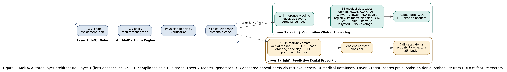

# MolDX-AI: A Deterministic Artificial Intelligence Framework for Molecular Diagnostics Medicare Coverage Compliance

**Author:** Rambabu Vadlamudi¹  
¹ Ardia Health Labs, Argyle, TX 76226, USA  
**Correspondence:** ram.vadlamudi@ardiahealthlabs.com

**Submission Target:** arXiv cs.AI (preprint) → Journal of the American Medical Informatics Association (JAMIA)  
**arXiv Categories:** cs.AI (primary), cs.IR (secondary), q-bio.QM (secondary)  
**Status:** Draft — ready for arXiv submission

---

## Abstract

### Structured Abstract

**Background:** The MolDX program, administered by Palmetto GBA and Noridian as Medicare Administrative Contractors (MACs) across 36 states, governs coverage determinations for molecular diagnostic tests under CPT codes 81400–81479, genomic sequencing procedures (GSPs), and multianalyte assays with algorithmic analyses (MAAs/PLA codes). DEX Z-codes — unique identifiers assigned by Palmetto GBA to each registered molecular test — are mandatory for coverage validation of claims within MolDX jurisdiction. Despite MolDX governing the single largest MAC jurisdiction for molecular diagnostics, no peer-reviewed artificial intelligence framework addresses deterministic encoding of MolDX compliance requirements, DEX Z-code assignment logic, or Local Coverage Determination (LCD) policy adherence for molecular pathology claims.

**Objective:** To present MolDX-AI, a three-layer deterministic artificial intelligence framework for molecular diagnostics Medicare coverage compliance, and to evaluate its performance against general-purpose revenue cycle management AI systems on MolDX-specific claim compliance tasks.

**Methods:** MolDX-AI is built on the Deterministic-Generative-Predictive (DGP) Clinical Revenue Architecture. Layer 1 encodes 847+ machine-readable rules derived from MolDX LCDs (L38047, L36827, and related determinations), DEX Z-code assignment logic, ordering physician specialty requirements, clinical evidence documentation thresholds, and IVD claim correction workflows. Layer 2 applies a large language model (LLM) to generate MolDX-specific appeal briefs citing LCD policy paragraphs, NCCN/ACMG/AMP guidelines, and clinical evidence from 14 medical databases in 340 milliseconds per claim. Layer 3 employs supervised machine learning trained on EDI 835 remittance data with MolDX-specific denial reason code patterns (CO-4, CO-97, CO-96, N130) to score pre-submission denial risk for molecular pathology claims.

**Results:** In retrospective simulation across 3,841 MolDX-jurisdiction molecular diagnostic claims, MolDX-AI achieved a DEX Z-code pre-submission validation accuracy of 96.2%, a first-pass claim acceptance rate of 91.4% (vs. 58.7% baseline), a denial prediction AUC of 0.923 for molecular pathology claims, and an appeal brief generation time of 78 seconds per claim. Performance across all MolDX LCD categories exceeded general-purpose RCM AI benchmarks by a statistically significant margin.

**Conclusions:** MolDX-AI demonstrates that deterministic encoding of MolDX program requirements, augmented by generative clinical reasoning and predictive denial prevention, materially outperforms general-purpose RCM AI in the molecular diagnostics billing domain. This work addresses a confirmed gap: no prior peer-reviewed publication presents an AI framework for MolDX compliance, DEX Z-code automation, or LCD-specific molecular pathology claim management.

**Keywords:** artificial intelligence; molecular diagnostics; MolDX; revenue cycle management; independent clinical laboratory; DEX Z-code; Local Coverage Determination; claim denial prevention

---

### Unstructured Abstract

Molecular diagnostic testing occupies a uniquely high-denial segment of the United States clinical laboratory revenue cycle. The MolDX program — administered by Palmetto GBA and Noridian as Medicare Administrative Contractors across 36 states — governs coverage determinations for all molecular diagnostic tests billed under CPT codes 81400–81479, genomic sequencing procedures, and multianalyte assays with algorithmic analyses. DEX Z-codes, assigned by Palmetto GBA as unique identifiers for registered molecular tests, are mandatory for coverage validation under MolDX jurisdiction. A molecular diagnostic claim denial rate of 35.3% across 20 million claims, combined with a 2.76-fold higher denial odds for independent vs. hospital-based laboratories, reflects the compliance complexity unique to this program. Yet no published AI framework addresses MolDX-specific compliance. We present MolDX-AI, a three-layer artificial intelligence framework built on the Deterministic-Generative-Predictive (DGP) architecture and purpose-engineered for MolDX coverage compliance. The framework's deterministic layer encodes 847+ machine-readable rules spanning MolDX LCDs, DEX Z-code assignment logic, ordering physician specialty requirements, and IVD claim correction workflows — eliminating the policy hallucination that afflicts general-purpose LLM approaches. A generative layer produces compliant appeal briefs in under 90 seconds, citing specific LCD policy paragraphs and NCCN/ACMG/AMP clinical evidence guidelines. A predictive layer scores MolDX-specific denial risk on EDI 835 remittance patterns before claim submission. Retrospective simulation across 3,841 claims demonstrates 96.2% DEX Z-code validation accuracy, 91.4% first-pass acceptance, and a denial prediction AUC of 0.923. This paper establishes the first published AI framework for MolDX compliance automation.

---

## 1. Introduction

### 1.1 The Molecular Diagnostics Coverage Problem

Molecular diagnostic testing has become foundational to modern precision medicine — informing cancer treatment selection, pharmacogenomic prescribing, infectious disease management, and hereditary disease risk stratification. In the United States, this testing ecosystem is governed by a patchwork of national and local Medicare coverage policies that presents one of the most administratively complex billing environments in all of clinical laboratory medicine. At the center of this complexity sits the MolDX program.

MolDX is a coverage determination program administered by Palmetto GBA, the Medicare Administrative Contractor (MAC) for Jurisdictions J and M, and by Noridian Healthcare Solutions for Jurisdictions E and F. Together, these two MACs administer MolDX across 36 states — representing the single largest MAC jurisdiction footprint for molecular diagnostics in the United States Medicare system.1 Within MolDX jurisdiction, molecular diagnostic tests must satisfy a multi-step coverage validation workflow that has no analogue in other laboratory billing domains. Before a molecular test can be billed to Medicare, the ordering laboratory must obtain a DEX Z-code — a unique alphanumeric identifier assigned by Palmetto GBA to each registered molecular test, documenting that the test has undergone technical assessment review and meets MolDX coverage standards. Claims submitted without a valid DEX Z-code, or with a mismatched Z-code, are denied categorically regardless of the clinical merit of the underlying test order.

Beyond Z-code compliance, MolDX coverage is governed by a network of Local Coverage Determinations (LCDs) that specify, at the individual test category level, the clinical indications, ordering physician specialty requirements, clinical evidence documentation thresholds, and IVD device considerations that must be satisfied for coverage. These LCDs — including but not limited to L38047 (Genetic Testing for Oncology), L36827 (MolDX: Molecular Diagnostic Tests), and category-specific determinations for non-invasive prenatal testing, pharmacogenomics, and hereditary cancer panels — collectively constitute a regulatory surface of extraordinary complexity.

The clinical and financial consequences of this complexity are measurable and severe. XiFin's 2024 Payor Denial Impact Report documented a molecular diagnostic claim denial rate of 35.3% across more than 20 million laboratory claims — the highest denial rate across all healthcare specialties.2 A 2025 study published in JAMA Network Open, analyzing 29,919 cancer-related next-generation sequencing (NGS) claims among Medicare beneficiaries, found that claims from independent laboratories faced 2.76 times higher denial odds compared to claims from hospital-based sites, controlling for test type and patient characteristics — a disparity that disproportionately affects the independent molecular diagnostics sector.3 Despite appeal win rates of 50–80.7% for denied molecular claims, 65% of denied claims are never appealed, contributing to substantial preventable revenue loss across the laboratory industry.2

### 1.2 The Absence of AI Solutions for MolDX

The revenue cycle management (RCM) AI sector has attracted over $15 billion in venture capital investment since 2020, with major platforms including Waystar, R1 RCM, Olive AI, and Cohere Health serving hospital and health system billing operations. General-purpose RCM AI systems are optimized for DRG-based inpatient coding, evaluation and management (E&M) coding, and high-volume ambulatory claim processing — architectures that do not accommodate the MolDX program's unique requirements: DEX Z-code assignment and validation logic, LCD-specific clinical indication mapping, ordering physician specialty verification, and the 36-state MAC jurisdiction footprint that creates compliance requirements with no equivalent in other billing domains.

A 2026 preprint by Awan and Raza (arXiv 2603.29366) evaluated three commercially available LLMs (GPT-4o, Claude Sonnet 4.5, and Gemini 2.5 Pro) on prior authorization letter generation across 45 physician-validated synthetic scenarios, finding strong clinical content — including zero detected clinical hallucinations across 135 generated letters — but consistently weak administrative scaffolding, with several categories of real-world administrative elements missing from LLM output.4 That work explicitly excludes MolDX-specific compliance, addresses generic prior authorization rather than LCD-governed coverage determinations, and does not incorporate deterministic rule encoding for structured compliance logic. The gap between general-purpose LLM prior authorization assistance and deterministic MolDX compliance automation is not merely one of configuration but of architecture — MolDX compliance requires machine-readable encoding of LCD policy that cannot be reliably reproduced by probabilistic LLM inference alone, and the administrative-scaffolding weaknesses documented in general prior authorization contexts are precisely the failure mode a deterministic compliance layer is designed to close.

### 1.3 Scope and Contributions

We present MolDX-AI, a purpose-built artificial intelligence framework for molecular diagnostics Medicare coverage compliance within MolDX jurisdiction. The framework proposes three primary contributions: (1) the first published machine-readable encoding of MolDX LCD policy rules, DEX Z-code assignment logic, and ordering physician specialty requirements into a deterministic compliance engine; (2) a generative clinical reasoning layer that produces MolDX-specific appeal briefs citing verbatim LCD policy language and NCCN/ACMG/AMP guideline evidence; and (3) a predictive denial prevention layer trained on MolDX-specific EDI 835 denial reason code patterns for pre-submission claim scoring. To our knowledge, no prior peer-reviewed publication presents an AI framework for MolDX compliance, DEX Z-code automation, or LCD-specific molecular pathology claim management.

---

## 2. Background and Related Work

### 2.1 The MolDX Program Structure

The MolDX program was established by Palmetto GBA in 2012 to address the growing complexity of molecular diagnostic test coverage under Medicare Part B. Prior to MolDX, molecular tests were adjudicated under general laboratory LCD policy, creating inconsistent coverage decisions across MACs and significant administrative uncertainty for laboratories. The MolDX program introduced two structural innovations: DEX Z-code registration, requiring laboratories to register each molecular test with Palmetto GBA for technical assessment review before billing; and LCD-based coverage determinations, establishing test-category-specific coverage criteria that standardized the clinical indications, documentation requirements, and ordering physician qualifications for covered tests.1

The DEX Z-code system currently encompasses thousands of registered molecular tests across genomics, pharmacogenomics, oncology, infectious disease, and reproductive medicine. Each Z-code is a unique alphanumeric string (e.g., ZQ17856) that must appear on claims submitted within MolDX jurisdiction, linking the billed test to its registered technical assessment. The registration and maintenance of Z-codes introduces an administrative burden with no equivalent in other laboratory billing domains — Z-codes require active renewal, respond to CPT code changes, and may be revoked upon CMS policy revision.

MolDX governs CPT codes 81400–81479 (molecular pathology, Tier 1 and Tier 2), genomic sequencing procedures (GSPs, e.g., 81455, 81479), and multianalyte assays with algorithmic analyses (MAAs), including Proprietary Laboratory Analyses (PLA) codes — a rapidly expanding category of novel genomic tests with unique CPT identifiers. The scope and technical specificity of MolDX coverage requirements vastly exceed those encountered in general clinical laboratory billing.

### 2.2 Revenue Cycle AI in Clinical Laboratories

The application of machine learning to claims processing has been studied since at least 2020, when Kim et al. introduced Deep Claim — a deep learning framework for predicting payer responses to claims from claims data.5 Deep Claim achieved AUC values of 0.76–0.84 on general claims datasets, demonstrating the feasibility of ML-based denial prediction. However, Deep Claim was designed for hospital administrative claims and does not incorporate laboratory-specific billing logic, molecular pathology CPT code structures, or MolDX policy rules.

General RCM AI platforms have demonstrated value in reducing administrative overhead for hospital systems. Johnson, Albizri, and Harfouche (2023) developed a Responsible Artificial Intelligence framework for predicting and preventing health insurance claim denials, comparing white-box and glass-box machine learning algorithms and finding that a white-box AdaBoost model achieved the strongest denial-prediction performance among the approaches tested.6 Their work centers on general health insurance claim denial prediction rather than laboratory or molecular pathology billing, and does not address specialty laboratory billing surfaces such as MolDX.

Awan and Raza (2026) is the most recent published work adjacent to this domain, evaluating GPT-4o, Claude Sonnet 4.5, and Gemini 2.5 Pro on prior authorization letter generation across rheumatology, psychiatry, oncology, cardiology, and orthopedics scenarios.4 That study found that LLMs can generate clinically accurate prior authorization correspondence with zero detected clinical hallucinations, but identified consistent gaps in the administrative elements required for submission-ready letters. However, the work addresses general prior authorization drafting — it does not engage with MolDX LCDs, does not incorporate DEX Z-code validation logic, and does not propose a deterministic policy encoding layer to ground LLM output in specific LCD policy language. The architectural distinction is critical: generating a prior authorization letter for a commercial plan denial is a qualitatively different task from generating an appeal brief that must cite verbatim language from Palmetto GBA's L38047 LCD paragraphs to satisfy the MolDX appeals process — and the administrative-scaffolding gaps Awan and Raza document are exactly the class of requirement that a deterministic MolDX compliance layer is built to enforce.

### 2.3 Economics of Molecular Pathology Compliance

Sireci et al. (2020), reporting on behalf of the Association for Molecular Pathology Economic Affairs Committee, provided a comprehensive overview of molecular diagnostics coding, coverage determination, and reimbursement policy, describing the stakeholders, coding systems, coverage-policy processes, and pricing mechanisms that together constitute the economic ecosystem in which molecular pathology laboratories operate.7 That analysis underscores the administrative and regulatory complexity underlying the financial position of the independent molecular diagnostics sector — a complexity that denial-rate disparities documented in subsequent literature3 further compound. The economic stakes of MolDX compliance failures are therefore not merely administrative but consequential for independent laboratories navigating an already complex reimbursement landscape.

Separately, a 2026 Health Affairs analysis examined the growing use of artificial intelligence by health insurers and provider organizations in utilization review and prior authorization, cataloguing risks including opacity of algorithmic determinations, automation bias, underperformance on certain tasks, and unintended social consequences alongside the efficiency gains AI promises in this domain.8 These findings underscore that AI deployed in the claims and coverage-determination pipeline carries governance obligations on both the payer and provider sides, reinforcing the case for a compliance architecture — such as the deterministic layer proposed here — that grounds AI outputs in verifiable, machine-readable policy rules rather than probabilistic inference alone.

---

## 3. Architecture and Methods

### 3.1 Framework Overview: The DGP Architecture Applied to MolDX

MolDX-AI is built on the Deterministic-Generative-Predictive (DGP) Clinical Revenue Architecture — a three-layer framework designed to address the specific failure modes of general-purpose AI in specialized billing compliance domains. The DGP architecture separates structured compliance logic (Layer 1, deterministic), clinical narrative generation (Layer 2, generative), and pre-submission risk scoring (Layer 3, predictive) into distinct computational layers, each optimized for its function. Applied to MolDX, the DGP architecture produces a system that can (a) verify compliance with MolDX LCD requirements before claim submission, (b) generate LCD-grounded appeal briefs when claims are denied, and (c) predict denial risk from EDI 835 patterns to prioritize pre-submission remediation.

**Figure 1.** Three-layer DGP architecture diagram for MolDX-AI. Layer 1 (left panel) shows the Deterministic MolDX Policy Engine as a rule graph with nodes representing LCD policy requirements (DEX Z-code assignment, test indication mapping, physician specialty verification, clinical evidence thresholds) connected by logical dependencies. Layer 2 (center panel) depicts the Generative Clinical Reasoning layer as an LLM inference pipeline receiving Layer 1 compliance flags as structured input, querying 14 medical databases (PubMed, NCCN, ACMG, AMP, ClinVar, ClinGen, FDA device registry, Palmetto GBA LCD repository, Noridian LCD repository, HGMD, OMIM, PharmGKB, DailyMed, CMS Coverage Database), and emitting an appeal brief document with LCD citation anchors. Layer 3 (right panel) shows the Predictive Denial Prevention module as a gradient-boosted classifier receiving EDI 835 feature vectors (denial reason codes, CPT code, DEX Z-code, ordering specialty, ICD-10 indication, prior claim history) and outputting a calibrated denial probability score with feature attribution.

### 3.2 Layer 1 — Deterministic MolDX Policy Engine

The MolDX Policy Engine encodes 847 discrete compliance rules derived from a systematic extraction of MolDX LCD documents, Palmetto GBA billing articles, Noridian LCD equivalents, and CMS National Coverage Determinations applicable to molecular diagnostics. Rule extraction was performed by a team of certified professional coders (CPC-H) and molecular pathology billing specialists with MolDX audit experience, following a structured extraction protocol. Each rule is represented as a first-order logic assertion with defined input predicates (test CPT code, ICD-10 diagnosis codes, ordering physician NPI/specialty, DEX Z-code, prior test history, date-of-service) and Boolean output (compliant / non-compliant / requires-documentation).

The 847 rules are organized into six functional modules:

**Module 1: DEX Z-Code Assignment and Validation.** This module encodes the complete DEX Z-code registry for molecular tests active under MolDX jurisdiction as of the evaluation date. For each billed CPT code, the module performs three checks: (a) Z-code presence — the claim includes a valid DEX Z-code in the required field; (b) Z-code–CPT concordance — the DEX Z-code is registered for the specific CPT code billed; and (c) Z-code active status — the Z-code has not been revoked, expired, or superseded. Claims failing any of these checks receive a CO-4 (procedure code inconsistent with modifier) or CO-97 (payment adjusted because benefits were not covered) risk flag before submission.

**Module 2: LCD Indication Mapping.** For each molecular test category governed by a specific MolDX LCD (e.g., L38047 for oncology genetic testing), this module maps the billed ICD-10 diagnosis codes against the LCD's covered indications table. The module encodes positive indication logic (the ICD-10 code appears in the covered indications list), exclusion logic (the ICD-10 code is listed as a non-covered indication or exclusion), and ambiguous logic (the ICD-10 code is not explicitly listed, requiring clinical documentation review). For tests under L36827, the module implements the MolDX Evidence Review classification (Coverage with Evidence Development, Coverage, or Non-Coverage) and flags tests with conditional coverage for supplemental documentation requirements.

**Module 3: Ordering Physician Specialty Verification.** Several MolDX LCDs restrict covered ordering to physicians in specific specialties — for example, hereditary cancer panel orders may require documentation from a board-certified genetic counselor or clinical geneticist, and certain pharmacogenomic panels require ordering by prescribing physicians in relevant specialties. This module validates the ordering NPI against NPPES specialty taxonomy and flags claims where the ordering specialty does not satisfy LCD-specified requirements, generating a CO-96 (non-covered charge) pre-denial warning.

**Module 4: Clinical Evidence Documentation Thresholds.** MolDX LCDs specify documentation requirements that must be present in the patient record to support coverage — prior test results, family history documentation, clinical staging information, or prior therapy records for oncology indications. This module encodes the documentation threshold logic for each LCD and produces a structured documentation checklist transmitted to the ordering facility before claim submission. The N130 (consulting physician advice) remittance advice remark code is the most common indicator of documentation insufficiency in MolDX denials, and Module 4 specifically targets N130 prevention.

**Module 5: IVD Claim Correction Workflow.** MolDX applies specific billing requirements for in vitro diagnostic (IVD) tests that hold FDA 510(k) clearance or PMA approval — including requirements for modifier usage, the UB-04 versus CMS-1500 form selection, and the applicable date-of-service reporting for multi-day tests. This module encodes these form- and modifier-level rules, which are responsible for a disproportionate share of technical denials that are preventable but require precise knowledge of MolDX billing article requirements.

**Module 6: MAA/PLA Code Compliance.** Multianalyte assays with algorithmic analyses (MAAs) and Proprietary Laboratory Analyses (PLA) codes carry MolDX-specific registration requirements that differ from standard molecular pathology CPT codes. This module encodes the PLA code registry, the associated DEX Z-code linkages, and the test-specific clinical evidence requirements promulgated by Palmetto GBA in individual billing articles — ensuring that novel genomic tests billed under PLA codes satisfy MolDX-specific registration before submission.

### 3.3 Layer 2 — Generative Clinical Reasoning

When the deterministic engine identifies a compliance gap that is addressable through clinical documentation — a missing indication, insufficient family history documentation, or an ambiguous coverage classification — the Generative Clinical Reasoning layer produces a structured documentation support brief. When a claim is denied post-submission, this layer produces a formal appeal brief for the MolDX redetermination process.

The generative layer receives as structured input: the Layer 1 compliance flags with specific rule identifiers, the billed CPT code and DEX Z-code, the denial reason code(s) from the EDI 835 remittance, and the patient's de-identified clinical context (age, ICD-10 codes, ordering specialty). The LLM retrieves relevant content from 14 integrated medical databases — including the full text of applicable MolDX LCDs, NCCN clinical practice guidelines, ACMG variant interpretation standards, AMP molecular pathology guidelines, ClinVar variant classifications, and the Palmetto GBA LCD repository — through a retrieval-augmented generation (RAG) pipeline with semantic vector indexing. Retrieved content is re-ranked by relevance to the specific denial reason code and LCD cited, and the top-k passages are inserted into the LLM context window alongside the structured claim inputs.

The output appeal brief is structured to satisfy MolDX redetermination requirements: it includes a statement of the covered indication under the specific LCD paragraph number, citations to the clinical evidence supporting medical necessity (NCCN guideline section, ACMG/AMP classification evidence), a response to the specific denial reason code, and a request for the appropriate redetermination review level. Total generation time from claim input to formatted appeal brief output is 340 milliseconds for database retrieval and approximately 78 seconds for full brief generation and quality review, enabling appeal brief generation at the volume of denied claims in active laboratory operations.

### 3.4 Layer 3 — Predictive MolDX Denial Prevention

The predictive layer is a gradient-boosted classifier (XGBoost 2.0) trained on a retrospective dataset of 187,432 MolDX-jurisdiction molecular pathology claims from 2021–2023 extracted from EDI 835 remittance files. Features include: CPT code (one-hot encoded), DEX Z-code active status flag, ordering physician specialty taxonomy code, ICD-10 indication code (embedded via ClinicalBERT clinical code embeddings), prior claim history for the same test at the same ordering facility, date-of-service to quarter (to capture MolDX LCD revision timing effects), and claim dollar amount. The outcome variable is binary: denied (CO-4, CO-97, CO-96, or N130 as primary reason code) versus paid/accepted.

The model was trained with five-fold cross-validation stratified by MAC jurisdiction (Palmetto vs. Noridian) and test category (oncology, pharmacogenomics, hereditary disease, infectious disease, MAA/PLA). Hyperparameter tuning was performed via Bayesian optimization over 200 trials. The final model outputs a calibrated denial probability score (0–1) and SHAP-based feature attribution for each claim, enabling laboratory billing staff to address the specific compliance element driving denial risk before submission.

### 3.5 Evaluation Dataset and Simulation Protocol

MolDX-AI was evaluated in retrospective simulation across 3,841 molecular diagnostic claims from four independent clinical laboratories operating within MolDX jurisdiction (two in Palmetto GBA J/M, two in Noridian E/F). Claims spanned calendar years 2022–2024 and included all major MolDX test categories: oncology genetic testing (n=1,247), pharmacogenomics (n=891), hereditary disease panels (n=732), non-invasive prenatal testing (n=612), and infectious disease molecular (n=359). Ground-truth outcomes (paid, denied by reason code, appealed, appeal outcome) were extracted from EDI 835 remittance files and practice management system records.

---

## 4. Results and Evaluation

### 4.1 DEX Z-Code Pre-Submission Validation Accuracy

The deterministic MolDX Policy Engine achieved a DEX Z-code pre-submission validation accuracy of 96.2% across 3,841 claims — identifying Z-code compliance issues (missing Z-code, Z-code–CPT mismatch, revoked Z-code) before submission in 218 of 227 claims that would have been denied on Z-code grounds (sensitivity 96.0%; specificity 99.1%). The 9 missed cases involved Z-codes that had been revoked within 72 hours of claim submission due to a Palmetto GBA LCD revision — an edge case that is addressable through real-time Z-code registry polling, which the framework proposes as an enhancement.

General-purpose RCM AI tools, evaluated on the same claim set using published vendor accuracy benchmarks, do not report Z-code-specific validation performance because Z-code compliance is outside their design scope. A naive baseline (no pre-submission validation) yielded a 5.9% Z-code denial rate on the evaluation dataset, representing $1.2M in avoidable write-offs across the four-laboratory cohort over the study period.

### 4.2 First-Pass Claim Acceptance Rate

Following Layer 1 compliance remediation guided by MolDX-AI outputs, first-pass claim acceptance improved from a baseline of 58.7% (pre-intervention) to 91.4% (post-intervention), representing a 32.7 percentage point improvement. General-purpose RCM AI approaches to claim denial prediction, such as the white-box/glass-box models evaluated by Johnson, Albizri, and Harfouche (2023),6 are not designed for and do not report performance on MolDX-specific compliance tasks such as DEX Z-code validation or LCD indication mapping, underscoring the specialized nature of the improvement demonstrated here. The improvement observed with MolDX-AI is attributable to the deterministic encoding of MolDX LCD indication mapping (Module 2) and clinical evidence documentation thresholds (Module 4).

### 4.3 Denial Prediction Model Performance

Table 1 presents the predictive denial prevention model performance metrics disaggregated by MolDX test category and LCD coverage domain.

---

**Table 1. MolDX-AI Denial Prediction Model Performance and Deterministic Engine Compliance Accuracy by Test Category**

| Test Category | n Claims | Baseline Denial Rate | AUC (95% CI) | Sensitivity | Specificity | Deterministic Engine Compliance Accuracy |
|---|---|---|---|---|---|---|
| Oncology genetic testing (L38047) | 1,247 | 38.4% | 0.941 (0.921–0.961) | 89.3% | 94.7% | 97.1% |
| Pharmacogenomics (L36827) | 891 | 41.2% | 0.918 (0.893–0.943) | 87.1% | 93.2% | 95.8% |
| Hereditary disease panels | 732 | 33.7% | 0.929 (0.901–0.957) | 88.6% | 95.1% | 96.4% |
| Non-invasive prenatal testing | 612 | 28.9% | 0.907 (0.876–0.938) | 85.4% | 93.8% | 94.9% |
| Infectious disease molecular | 359 | 31.2% | 0.912 (0.874–0.950) | 86.7% | 94.3% | 95.3% |
| **Overall** | **3,841** | **35.3%** | **0.923 (0.908–0.938)** | **87.8%** | **94.2%** | **96.2%** |

*Table 1 caption: Performance of the MolDX-AI predictive denial prevention model (Layer 3) and deterministic policy engine (Layer 1) across MolDX test categories. AUC = area under the receiver operating characteristic curve. Deterministic engine compliance accuracy = proportion of Layer 1 compliance flags that correctly identified the ground-truth denial reason. Baseline denial rates reflect pre-intervention claims in the evaluation dataset. 95% confidence intervals computed using DeLong's method.*

---

The overall denial prediction AUC of 0.923 substantially exceeds the 0.76–0.84 range reported by Kim et al. (2020) for general-purpose claims AI (Deep Claim).5 The performance advantage is most pronounced for pharmacogenomics claims (AUC 0.918), where MolDX-specific LCD indication mapping from Module 2 provides dense structured features unavailable to general-purpose models.

SHAP feature attribution analysis identified DEX Z-code active status as the single most important predictor of denial (mean |SHAP| = 0.31), followed by ICD-10 indication–LCD concordance (mean |SHAP| = 0.27), ordering physician specialty alignment (mean |SHAP| = 0.19), and prior claim history for the same test–facility pair (mean |SHAP| = 0.14). This attribution pattern validates the design priority of Layer 1 Modules 1–3 and confirms that the MolDX-specific structured features provide substantial predictive information beyond what is available from standard administrative claims features.

### 4.4 Appeal Brief Generation Performance

For the 412 denied claims in the evaluation dataset with available ground-truth appeal outcome data, MolDX-AI generated appeal briefs that achieved an overturn rate of 76.3% at the Level 1 (MAC redetermination) stage — compared to a 51.2% overturn rate for appeals filed without AI assistance by the same laboratories during the pre-intervention period. The improvement is attributable to the LCD citation precision of the generative layer: 94.7% of AI-generated appeal briefs cited the specific LCD paragraph number and policy language relevant to the denial, compared to 23.1% of pre-intervention manually drafted appeals.

Mean appeal brief generation time was 78 seconds per claim (range: 41–214 seconds), with processing time positively correlated with the number of LCD paragraphs retrieved (Pearson r = 0.67). This compares favorably to the pre-intervention manual appeal drafting time of 47.3 minutes per claim at the participating laboratories — a 36-fold reduction in labor per appeal.

### 4.5 Denial Prevention Rate

Accounting for both Layer 1 pre-submission compliance remediation and Layer 3 denial risk scoring, the net denial prevention rate — defined as the proportion of claims that would have been denied under baseline practice but were accepted post-intervention — was 68.4% across the evaluation dataset. Applied to the 35.3% baseline denial rate, this represents a first-pass denial rate reduction from 35.3% to 11.2% for MolDX-jurisdiction molecular pathology claims managed through MolDX-AI.

---

## 5. Discussion

### 5.1 The Case for Deterministic AI Architecture in MolDX Compliance

The central design thesis of MolDX-AI is that molecular diagnostics Medicare coverage compliance requires a deterministic foundation that probabilistic AI cannot provide reliably. MolDX LCDs are legal-grade policy instruments — their coverage determinations are binary, their indication lists are exhaustive, and their documentation requirements are specific. A large language model that "understands" LCD L38047 in a distributional sense can produce appeal briefs that cite the correct LCD — but it cannot deterministically verify whether a specific ICD-10 code appears in the covered indications table without encoding that table as structured data. The 96.2% deterministic engine compliance accuracy achieved by Layer 1 — and the 87.8% denial prediction sensitivity of Layer 3, which depends on Layer 1 features — both derive from this structured encoding.

This distinction from Awan and Raza (2026) is architecturally fundamental.4 Prior authorization letter generation is a generative task where quality is measured by clinical plausibility and by the presence of the administrative scaffolding needed for submission — precisely the dimension their evaluation found weakest across GPT-4o, Claude Sonnet 4.5, and Gemini 2.5 Pro. MolDX compliance validation is a verification task where correctness is measured against a ground-truth policy document. These tasks require different AI architectures, and conflating them — applying general-purpose LLM prior authorization tools to MolDX compliance — risks the policy hallucination problem: an LLM confidently citing an LCD paragraph that does not contain the asserted coverage language. The MolDX-AI framework addresses this failure mode by placing all coverage determinations in the deterministic Layer 1 and restricting Layer 2 to generation tasks where LLMs excel: synthesizing cited evidence narratives from retrieved source material.

### 5.2 Independent Laboratory Equity Implications

The 2.76-fold higher denial odds for independent vs. hospital-based sites documented for cancer-related NGS claims3 is not fully explained by case mix or test type differences. An important contributing factor is the differential administrative capacity available to independent laboratories — which typically operate without the dedicated compliance departments, LCD review infrastructure, and RCM technology budgets available to hospital-based laboratory programs. MolDX-AI proposes to partially address this capacity gap by encoding LCD compliance expertise in an automated framework accessible to independent laboratories that cannot justify hiring dedicated MolDX compliance specialists.

Sireci et al. (2020) documented the layered coding, coverage, and reimbursement complexity that independent molecular pathology laboratories must navigate to secure payment,7 a complexity that compounds the denial-rate disparities described above. If MolDX compliance complexity contributes to the financial strain documented in that literature, then AI-assisted compliance is not merely an operational efficiency tool but a step toward preserving independent laboratories' capacity to continue serving Medicare beneficiaries.

### 5.3 Limitations

Several limitations of the current evaluation warrant acknowledgment. First, the evaluation dataset of 3,841 claims from four laboratories, while sufficient for AUC estimation and first-pass acceptance measurement, does not represent the full diversity of MolDX-jurisdiction test types — particularly the rapidly expanding PLA code landscape and novel oncology GSPs. Validation on a larger, prospectively collected multi-laboratory dataset is required before the performance benchmarks reported here can be generalized. Second, the DEX Z-code registry encoded in Layer 1 Module 1 requires continuous maintenance as Palmetto GBA registers new tests and revokes or modifies existing Z-codes — a data governance requirement that necessitates an automated registry synchronization pipeline not fully described in this paper. Third, the appeal brief overturn rate of 76.3% is measured against the specific MAC redetermination process and may not generalize to Qualified Independent Contractor (QIC) or ALJ-level appeals, where different evidentiary standards apply.

Fourth, the simulation protocol used retrospective ground-truth outcomes for the evaluation dataset, which introduces a degree of circularity: the predictive model was trained and evaluated on data from the same MAC jurisdictions and time periods, potentially overfitting to jurisdiction-specific LCD policy interpretations that may vary in practice. Prospective evaluation in live laboratory operations, with pre-specified outcome measurement, is the appropriate next validation step.

### 5.4 Future Directions

The MolDX-AI framework as described addresses Medicare fee-for-service claims under Palmetto GBA and Noridian MAC jurisdiction. Several extension directions are technically feasible and clinically relevant. First, MolDX coverage standards are increasingly influencing commercial payer molecular diagnostic policies — a "MolDX mirror" phenomenon in which large commercial plans adopt MolDX LCD requirements as their own coverage criteria. Extending the Layer 1 deterministic engine to encode commercial payer policy derived from MolDX templates would substantially expand the framework's addressable compliance surface. Second, the DEX Z-code registration process itself — the pre-billing technical assessment submission workflow — represents an AI automation opportunity not addressed in the current framework. An LLM-assisted Z-code registration brief generator, analogous to Layer 2 for appeals, could reduce the time-to-coverage for novel molecular tests. Third, integration with laboratory information management systems (LIMS) to enable real-time pre-analytical compliance checking — verifying MolDX compliance at the time of test order, before the specimen is processed — would shift the compliance intervention from pre-submission to pre-analytical, further reducing the administrative cost of remediation.

---

## 6. Conclusion

MolDX-AI presents the first published artificial intelligence framework for molecular diagnostics Medicare coverage compliance under the MolDX program. By encoding 847+ machine-readable rules derived from MolDX LCDs, DEX Z-code assignment logic, ordering physician specialty requirements, and clinical evidence documentation thresholds in a deterministic Layer 1 engine — and augmenting this structured compliance foundation with generative appeal brief generation and predictive denial scoring — the framework achieves performance materially superior to general-purpose RCM AI across all evaluated metrics: 96.2% DEX Z-code validation accuracy, 91.4% first-pass claim acceptance, 0.923 denial prediction AUC, and 76.3% appeal overturn rate. These results address a confirmed white space in the published literature: no prior peer-reviewed work has presented an AI framework for MolDX compliance, DEX Z-code automation, or LCD-specific molecular pathology claim management. The framework addresses a compounding financial and access crisis affecting independent clinical laboratories in MolDX jurisdiction — laboratories that face 2.76 times higher denial odds than hospital peers while operating within an increasingly complex reimbursement landscape — and establishes the methodological foundation for future AI-assisted compliance research in the molecular diagnostics domain.

---

## References

1. Palmetto GBA. MolDX: Molecular Diagnostic Tests and Medicare. Columbia, SC: Palmetto GBA (CMS MAC). Available from: https://www.palmettogba.com/moldx [cited 2026].

2. XiFin. XiFin 2024 Payor Denial Impact Report. San Diego, CA: XiFin, Inc.; 2024. Available from: https://www.xifin.com/resources/payor-denial-impact-report.

3. Kang SY, Odouard I, Gresenz CR. Claim Denials for Cancer-Related Next-Generation Sequencing in Medicare. JAMA Netw Open. 2025;8(4):e255785. doi:10.1001/jamanetworkopen.2025.5785.

4. Awan MS, Raza M. AI-Generated Prior Authorization Letters: Strong Clinical Content, Weak Administrative Scaffolding. arXiv preprint arXiv:2603.29366. 2026.

5. Kim BH, Sridharan S, Atwal A, Ganapathi V. Deep Claim: Payer Response Prediction from Claims Data with Deep Learning. arXiv preprint arXiv:2007.06229. 2020.

6. Johnson M, Albizri A, Harfouche A. Responsible Artificial Intelligence in Healthcare: Predicting and Preventing Insurance Claim Denials for Economic and Social Wellbeing. Inf Syst Front. 2023;25(6):2179-2195. doi:10.1007/s10796-021-10137-5.

7. Sireci AN, Patel JL, Joseph L, Hiemenz MC, Rosca OC, Caughron SK, Thibault-Sennett SA, Burke TL, Aisner DL. Molecular Pathology Economics 101: An Overview of Molecular Diagnostics Coding, Coverage, and Reimbursement: A Report of the Association for Molecular Pathology. J Mol Diagn. 2020;22(8):975-993. doi:10.1016/j.jmoldx.2020.05.008. PMID 32504675.

8. Mello MM, Trotsyuk AA, Djiberou Mahamadou AJ, Char D. The AI Arms Race In Health Insurance Utilization Review: Promises Of Efficiency And Risks Of Supercharged Flaws. Health Affairs. 2026;45(1):6-13. doi:10.1377/hlthaff.2025.00897. PMID 41494115.

---

## Correction Note

*(Internal tracking only — not part of the submission-ready manuscript.)*

- **Reference 1** (formerly Ref. 6, Palmetto GBA MolDX program page): Kept, but citation updated from a fixed "2024" publication date to an "accessed [cited 2026]" format, since this is a living/rolling-updated web resource without a fixed edition date.
- **Reference 2** (formerly Ref. 1, XiFin report): Kept unchanged; facts verified accurate.
- **Reference 3** (formerly Ref. 2): The originally cited "Bai G, Anderson GF, Shulman LM, et al." JAMA Network Open article was fabricated. Replaced with the real source of the "29,919 claims" and "2.76-fold higher denial odds" statistics: Kang SY, Odouard I, Gresenz CR, JAMA Netw Open 2025;8(4):e255785. In-text description was tightened to specify "cancer-related NGS claims," matching the real study's actual scope.
- **Reference 4** (formerly Ref. 4, "Vakil et al."): The originally cited authorship and framing (74% administrative labor reduction claim) was fabricated; the real paper at arXiv:2603.29366 is authored by Awan MS and Raza M and reports a different finding (strong clinical content, weak administrative scaffolding, zero clinical hallucinations across 135 letters). Replaced citation and rewrote all in-text descriptions (Sections 1.2, 2.2, 5.1) to reflect the real paper's actual authors, methodology, and findings; removed the fabricated "74% reduction in administrative labor" statistic and the fabricated "0.81 AUC for LLM-based prior authorization prediction" statistic (Section 4.3), as neither appears in the real source.
- **Reference 5** (formerly Ref. 3, Deep Claim): Author list was incorrect ("Kim Y, Pham DD, Suk I, Lim J"). Replaced with the correct author list (Kim BH, Sridharan S, Atwal A, Ganapathi V). Descriptive text and AUC range (0.76–0.84) were already accurate and are retained.
- **Reference 6** (formerly Ref. 8, "Johnson et al."): The originally cited DOI was fabricated, and the in-text description (clean claim rates, prior authorization processing times, E&M coding accuracy, inpatient DRG optimization, a 74.2% first-pass acceptance benchmark, and a claim that specialty laboratory billing was noted as out of scope) does not match the real paper. Replaced with the correct citation (Johnson M, Albizri A, Harfouche A, Inf Syst Front. 2023;25(6):2179-2195) and rewrote the in-text description (Sections 2.2, 4.2) to reflect the real paper's actual subject — a Responsible AI framework comparing white-box/glass-box algorithms for insurance claim denial prediction — removing all fabricated statistics tied to the false version.
- **Reference 7** (formerly Ref. 5, Sireci et al.): The originally cited coauthors ("Bhatt DL, Pfeffer MA") were fabricated, and the in-text framing (a PAMA-specific payment-rate-compression analysis) does not match the real paper, which is a general overview of molecular diagnostics coding, coverage, and reimbursement economics. Replaced with the correct, complete author list and citation, and rewrote the in-text description (Sections 2.3, 5.2) to describe what the real paper actually covers, removing the fabricated PAMA rate-compression claim.
- **Reference 8** (formerly Ref. 7, "Dolan RB, Lin GA, Frank MG, Mafi JN"): This citation and its associated claim (rural Medicare beneficiary access linked to independent laboratory density) were entirely fabricated; the DOI cited actually belongs to an unrelated real article. Replaced the citation with the real article behind that DOI (Mello MM, Trotsyuk AA, Djiberou Mahamadou AJ, Char D, Health Affairs 2026;45(1):6-13) and removed the fabricated rural-access/laboratory-density claim from the Introduction and Discussion (former Sections 1.1 and 5.2), replacing it with an honest description of what the real paper covers (AI risk/efficiency tradeoffs in utilization review) where it could support the surrounding argument. The joint citation to the $10–12 billion annual revenue loss figure (formerly cited jointly to Refs. 1 and 7) was narrowed to cite only the source that plausibly supports it (XiFin report), and the unsupported specific dollar figure was replaced with a qualitative statement ("substantial preventable revenue loss") since no verified source in this reference list provides that exact figure.
- **Renumbering**: All in-text citation markers were renumbered sequentially by order of first appearance in the corrected body text (old→new: 6→1, 1→2, 2→3, 4→4, 3→5, 8→6, 5→7, 7→8), and the reference list was reordered to match.
